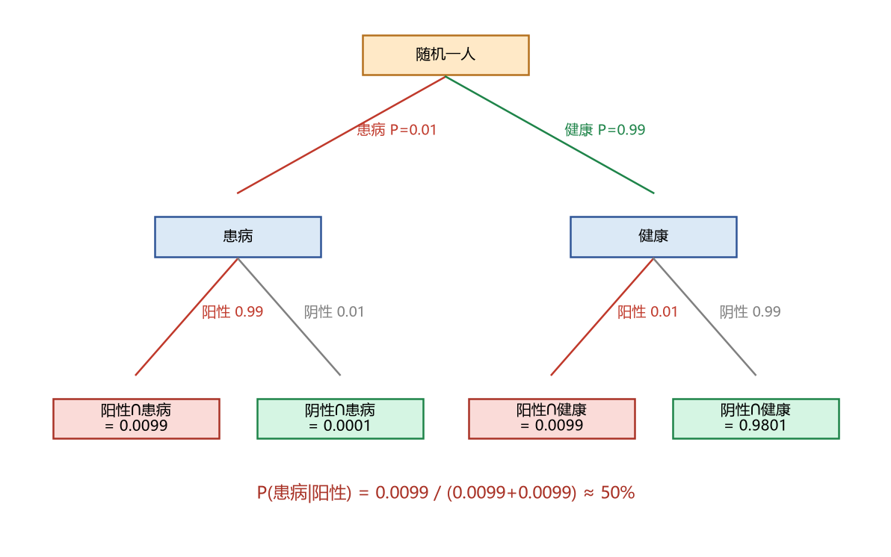

# 02 条件概率与贝叶斯定理

> 面试权重：★★★★★（几乎必考）｜ 难度：中 ｜ 来源：[S1][S2 Q1][S7] Blitzstein & Hwang Ch2-3
> 定位：量化面试第一高频考点；也是"信号 → 信念更新"的思维原型，回测严谨性模块靠它起底。

## 一、教学

### 1.1 条件概率

**定义**：已知 $B$ 发生的条件下，$A$ 发生的概率：

$$P(A|B) = \frac{P(A \cap B)}{P(B)}, \qquad P(B) > 0$$

**性质**（给定 $B$ 后仍是一条概率）：

$$0 \le P(A|B) \le 1, \qquad P(\Omega|B) = 1, \qquad P(A_1 \cup A_2 | B) = P(A_1|B) + P(A_2|B) \ (\text{互斥时})$$

### 1.2 乘法法则

$$P(A \cap B) = P(A|B)\,P(B)$$

推广到 $n$ 个事件：

$$P(A_1 A_2 \cdots A_n) = P(A_1)\,P(A_2|A_1)\,P(A_3|A_1A_2)\cdots P(A_n|A_1\cdots A_{n-1})$$

### 1.3 全概率公式

**定义（分割）**：若 $B_1, B_2, \dots, B_n$ 两两不相容且 $\bigcup_{i=1}^{n}B_i = \Omega$，则 $\{B_i\}$ 构成样本空间的一个分割。

**全概率公式**：

$$P(A) = \sum_{i=1}^{n} P(A|B_i)\,P(B_i)$$

> 注：$A$ 本身难算时，先按分割 $B_i$ 拆开，在每个 $B_i$ 上算条件概率再加权。

### 1.4 贝叶斯公式

$$P(B_i|A) = \frac{P(B_i)\,P(A|B_i)}{\sum_{j=1}^{n}P(B_j)\,P(A|B_j)}$$

**四个术语（面试要脱口而出）**：

- 先验 $P(B_i)$：看到数据前的信念（基准率）
- 似然 $P(A|B_i)$：假设为真时数据出现的概率
- 证据 $P(A)$：数据在所有假设下的加权平均
- 后验 $P(B_i|A)$：看到数据后更新过的信念

### 1.5 独立 vs 条件独立

**定义（独立）**：$P(AB) = P(A)P(B)$。独立事件不一定条件独立——两个事件独立，给定 $C$ 后可能相关。

**贝叶斯树（疾病检测）**：患病率 1%，敏感度 99%，特异度 99%。

$$P(\text{患病}|\text{阳性}) = \frac{0.99 \times 0.01}{0.99 \times 0.01 + 0.01 \times 0.99} = \frac{1}{2}$$

> 注：敏感度 = 特异度时恰好抵消；现实中两者往往不同，先验（患病率）越低，阳性后验越低。

## 二、例题精讲

**例 1｜两枚硬币：公平 vs 双正面**

随机取一枚抛一次出正面，是双正面的概率：

$$P(\text{双正}|\text{正}) = \frac{1 \times \frac{1}{2}}{1 \times \frac{1}{2} + \frac{1}{2} \times \frac{1}{2}} = \frac{2}{3}$$

**例 2｜策略信号更新（量化视角）**

先验 $P(\text{有 alpha}) = 10\%$；有 alpha 时命中率 60%，无 alpha 时运气命中率 50%。一次命中后：

$$P(\text{alpha}|\text{hit}) = \frac{0.6 \times 0.1}{0.6 \times 0.1 + 0.5 \times 0.9} \approx 11.8\%$$

> 结论：单次命中几乎不更新信念 → 量化研究需要大样本与多重检验，而不是看一两个漂亮数字。

**例 3｜Monty Hall**

先选 A，主持人开一扇羊门后：车在另外两扇门后的概率 $P(\text{车} \in B \cup C) = 2/3$，换门赢率 $2/3$。

## 三、面试题

**热身**

1. $P(A \cup B)$ 公式？ → $P(A)+P(B)-P(AB)$。
2. 三张牌（双红/双蓝/红蓝），随机抽一张见一面是红，另一面也红？ → $2/3$。

**核心**

3. Monty Hall 换门？ → $2/3$（初始选错概率 $2/3$ 不变）。
4. 两孩子：已知"至少一个男孩"，两个都男孩？ → $1/3$（样本空间 $\{BB, BG, GB\}$）。
5. 患病率 0.1%、敏感度 99%、特异度 99%，阳性后患病？ → ≈9%。

**进阶**

6. 伯特兰盒 → $2/3$。
7. 连续先验怎么更新？ → $P(\theta|\text{数据}) \propto P(\text{数据}|\theta)\,P(\theta)$，再归一化。

## 四、参考

- [S1] k3vv0 Probability（贝叶斯题带代码）
- [S7] Blitzstein & Hwang Ch2-3；绿皮书条件概率章节
