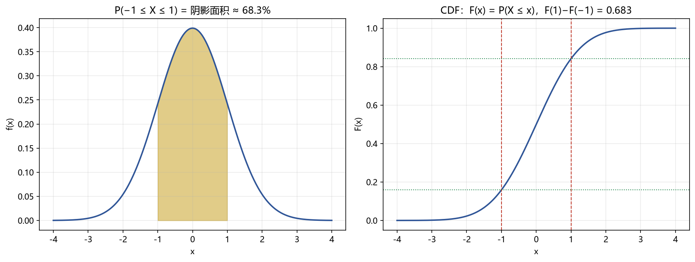
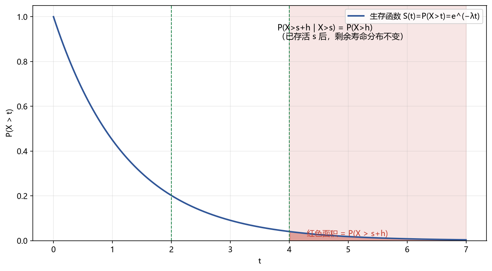
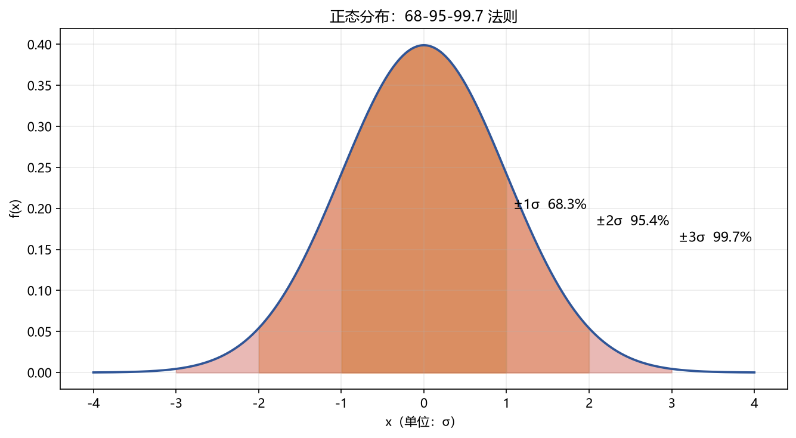

# 03 随机变量与常见分布

> 面试权重：★★★★☆ ｜ 难度：中 ｜ 来源：[S1][S2][S7] Blitzstein & Hwang Ch1-6
> 定位：把分布家族背成肌肉记忆——PMF/PDF、期望、方差、适用场景，面试官随手点一个都要接住。

## 一、教学

### 1.1 随机变量与分布函数

**定义（分布函数）**：

$$F(x) = P(X \le x), \qquad -\infty < x < \infty$$

F(x) 单调非降，F(-∞)=0，F(+∞)=1。

**离散型**：概率函数 pᵢ = P(X = aᵢ)，且 F(x) = Σ(aᵢ ≤ x) pᵢ。

**连续型**：存在密度函数 f(x) ≥ 0，∫(-∞,+∞) f(x) dx = 1，且

$$P(a \le X \le b) = F(b) - F(a) = \int_{a}^{b} f(x)\,dx$$

> 注：连续型下 P(X=x)=0；f(x) 不是概率，是"密度"。

### 1.2 离散分布

| 分布 | 概率函数 | 期望 | 方差 | 场景 |
| --- | --- | --- | --- | --- |
| Bernoulli(p) | pᵏ(1-p)¹⁻ᵏ | p | p(1-p) | 单次成败 |
| Binomial(n,p) | C(n,k)pᵏ(1-p)ⁿ⁻ᵏ | np | np(1-p) | n 次独立试验成功数 |
| Poisson(λ) | (λᵏ · e^(-λ))/k! | λ | λ | 稀有事件计数、跳跃、违约 |
| Geometric(p) | (1-p)ᵏ⁻¹p | 1/p | (1-p)/p² | 首次成功所需次数 |

**泊松近似二项**：X ~ B(n,p)，n 大、p 小，λ = np 不太大时，

$$\binom{n}{k}p^k(1-p)^{n-k} \approx \frac{\lambda^k e^{-\lambda}}{k!}$$

### 1.3 连续分布

| 分布 | 密度函数 | 期望 | 方差 | 场景 |
| --- | --- | --- | --- | --- |
| 正态 N(μ,σ²) | 1/(√(2π)σ) · e^(-((x-μ)²)/(2σ²)) | μ | σ² | 收益近似、CLT 极限 |
| 指数 Exp(λ) | λ e^(-λ x), x>0 | 1/λ | 1/λ² | 等待时间（无记忆性） |
| 对数正态 | ln X ~ N(μ,σ²) | e^(μ+σ²/2) | — | 价格、资产价值 |
| 均匀 U(a,b) | 1/(b-a) | (a+b)/2 | ((b-a)²)/(12) | 无信息先验、随机数 |
| t(ν) | — | 0（ν>1） | ν/(ν-2)（ν>2） | 小样本均值、肥尾 |
| χ²(k) | — | k | 2k | 方差检验、拟合优度 |
| F(d₁,d₂) | — | (d₂)/(d₂-2) | — | 回归整体显著性 |
| 柯西 | — | **不存在** | 不存在 | 期望陷阱反例 |

### 1.4 无记忆性（指数/几何）

**定理**：X ~ Exp(λ)（或几何），则

$$P(X > s+t \mid X > s) = P(X > t)$$

> 证明（指数）：P(X>s+t|X>s) = e^(-λ(s+t)) / e^(-λ s) = e^(-λ t) = P(X>t)。指数是唯一具有无记忆性的连续分布。

### 1.5 正态的性质（必背）

**标准化**：X ~ N(μ,σ²) ⇒ Z = (X-μ)/σ ~ N(0,1)。

**线性组合**：X,Y 独立正态 → aX + bY ~ N(aμ_X+bμ_Y, a²σ_X²+b²σ_Y²)。

**68-95-99.7**：

**对数正态期望**：Z ~ N(0,1) 的矩母函数 E[e^(tZ)] = e^(t²/2)，取 t=σ：

$$E[X] = E[e^{\mu + \sigma Z}] = e^{\mu} e^{\sigma^2/2}$$

## 二、例题精讲

**例 1｜泊松近似**：n=1000, p=0.002，λ = 2：

$$P(X=3) \approx \frac{2^3 e^{-2}}{3!} \approx 0.180$$

**例 2｜年化波动**：日收益独立 N(0, (1%)²)，252 日：

$$\sigma_{\text{年}} = \sqrt{252} \times 1\% \approx 15.9\%$$

**例 3｜为什么价格用对数正态**：价格必须非负，且"乘法收益"取对数后可加 → 建模 S_T = S₀ e^(μ T + σ√TZ)。

## 三、面试题

**热身**

1. Binomial(100, 0.5) 期望与标准差？ → 50 与 5。
2. Poisson(3) 至少一次？ → 1-e⁻³ ≈ 0.95。

**核心**

3. 证明几何分布无记忆性？ → P(X>s+t|X>s)=(1-p)ᵗ。
4. 正态 68-95-99.7 区间？ → μ ± kσ, k=1,2,3。
5. 为什么小样本用 t 分布？ → σ 由样本估计引入额外不确定性，t 尾更肥。

**进阶**

6. 柯西期望为什么不存在？ → ∫ |x|f(x)dx 发散。
7. 用矩母函数求 E[X²]？ → M''(0) = E[X²]。
8. 收益肥尾怎么回应？ → t/混合正态/GARCH 建模，并说明 CLT 收敛慢。

## 四、参考

- [S1] k3vv0 Probability（每个分布带 Python 演示）
- [S7] Blitzstein & Hwang Ch1-6；绿皮书分布题
