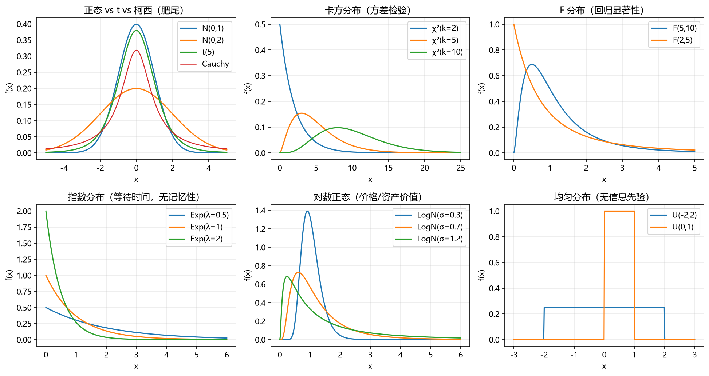
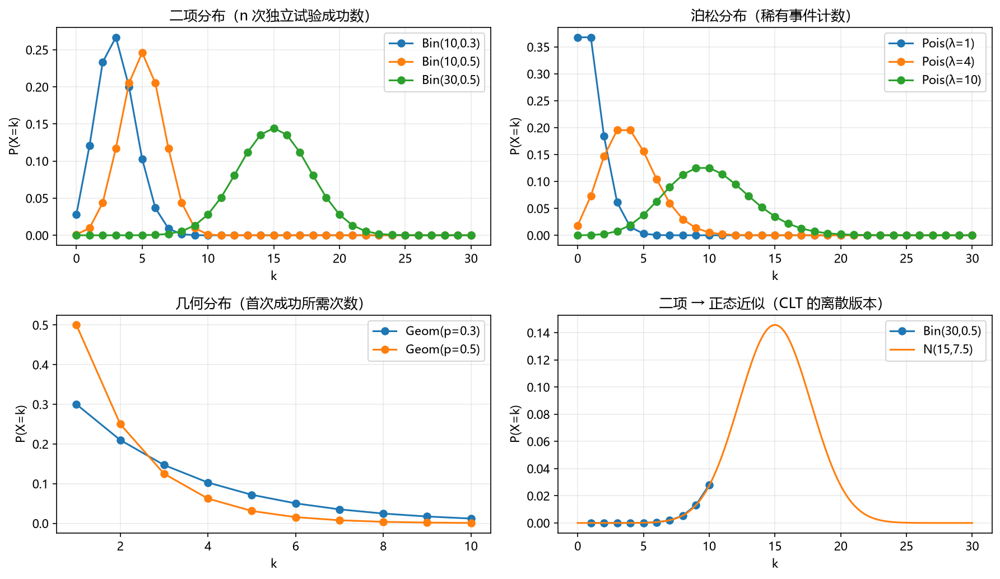

# 03 随机变量与常见分布

> 面试权重：★★★★☆ ｜ 难度：中 ｜ 来源：[S1][S2][S7] Blitzstein & Hwang Ch1-6
> 定位：把"分布家族"背成肌肉记忆——期望、方差、适用场景，面试官随手点一个都要立刻接住。

## 教学

**离散 vs 连续**

- 离散：PMF P(X=k)，取值可数（成功次数、事件计数）。
- 连续：PDF f(x)，概率是面积；CDF F(x)=P(X≤x)。
- 分布三件套必背：PMF/PDF、期望、方差。

**连续分布全家福**

| 分布 | 参数 | 期望 | 方差 | 金融/面试场景 |
| --- | --- | --- | --- | --- |
| 正态 N(μ,σ²) | μ, σ² | μ | σ² | 收益近似、CLT 极限 |
| t(ν) | 自由度 | 0（ν>1） | ν/(ν−2)（ν>2） | 小样本均值、肥尾 |
| 卡方 χ²(k) | 自由度 | k | 2k | 方差检验、拟合优度 |
| F(d1,d2) | 自由度 | d2/(d2−2) | — | 回归整体显著性 |
| 指数 Exp(λ) | 率 | 1/λ | 1/λ² | 等待时间，**无记忆性** |
| 对数正态 LogN | μ, σ | e^(μ+σ²/2) | 见下 | **价格、资产价值** |
| 均匀 U(a,b) | a,b | (a+b)/2 | (b−a)²/12 | 无信息先验、随机数 |
| 柯西 | 位置/尺度 | **不存在** | 不存在 | 反例（期望陷阱） |

**离散分布全家福**

| 分布 | 参数 | P(X=k) | 期望 | 方差 | 场景 |
| --- | --- | --- | --- | --- | --- |
| Bernoulli | p | p^k(1−p)^(1−k) | p | p(1−p) | 单次成败 |
| Binomial | n,p | C(n,k)p^k(1−p)^(n−k) | np | np(1−p) | n 次独立试验 |
| Poisson | λ | λ^k e^(−λ)/k! | λ | λ | 稀有事件、跳跃、违约 |
| Geometric | p | (1−p)^(k−1)p | 1/p | (1−p)/p² | 首次成功次数 |

**三个必背性质**

1. **指数/几何的无记忆性**：P(X>s+t|X>s)=P(X>t)。唯一连续的"无记忆"分布就是指数。
2. **对数正态期望**：若 lnS ~ N(μ,σ²)，则 E[S]=e^(μ+σ²/2)——定价公式里那个 σ²/2 就来自这里。
3. **正态线性组合**：独立 X,Y 正态 → aX+bY 正态，方差 a²σx²+b²σy²。

## 例题精讲

**例 1｜泊松近似二项**：n=1000、p=0.002 → Binomial 期望 2，泊松 λ=2 近似，P(X=3)≈(2³e^(−2))/3!≈0.180。

**例 2｜年化波动**：日收益独立 N(0, (1%)²)，252 天累计波动 = √252 × 1% ≈ 15.9%。

**例 3｜对数正态价格**：S_T = S_0·e^(μT+σ·√T·Z)，E[S_T] = S_0·e^(μT+σ²T/2)。为什么价格对数正态而不是正态？价格必须非负，且收益相乘 → 取对数可加。

## 面试题

**热身**

1. Binomial(100,0.5) 期望与标准差？ → 50 与 5。
2. Poisson(3) 某天至少一次？ → 1−e^(−3)≈0.95。

**核心**

3. 几何分布无记忆性怎么证？ → P(X>s+t|X>s)=(1−p)^t。
4. 正态 68-95-99.7 区间？ → μ±σ/±2σ/±3σ。
5. 为什么要 t 分布检验均值？ → 方差未知且样本小时，σ 由样本估计引入不确定性，t 更肥尾。

**进阶**

6. 柯西分布期望为什么不存在？ → 尾部积分 ∫|x|f(x)dx 发散。
7. 用 MGF 求 E[X²]？ → M''(0)=E[X²]（矩母函数是矩生成器）。
8. 收益率实际肥尾，面试中怎么回应？ → 用 t/混合正态/GARCH 建模，并说明 CLT 收敛慢。

## 参考

- [S1] k3vv0 Probability（每个分布带 Python 演示）
- [S7] Blitzstein & Hwang Ch1-6；绿皮书分布题
