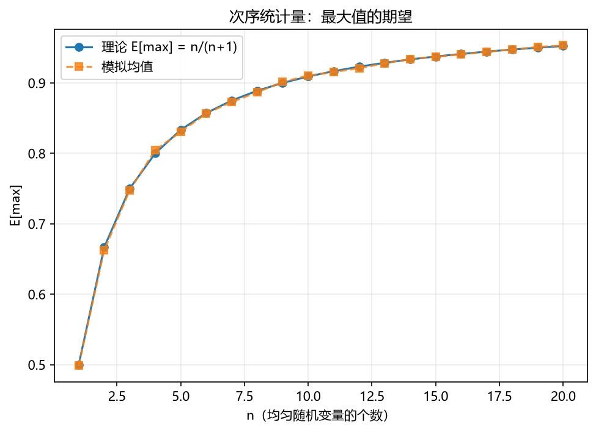

# 05 联合分布、协方差与条件期望

> 面试权重：★★★☆☆（买方进阶必考）｜ 难度：高 ｜ 来源：[S2 Q7][S7] Blitzstein & Hwang Ch7-9、Grinold & Kahn
> 定位：从"单个随机变量"进入"多个变量"——组合风险、因子相关性、条件期望都在这里。

## 教学

**联合分布与独立性**

- 联合 PDF/PMF f(x,y)；边缘分布 f_X(x)=∫f(x,y)dy。
- 独立 ⇔ f(x,y)=f_X(x)·f_Y(y) ⇔ E[g(X)h(Y)]=E[g(X)]E[h(Y)]。
- **独立 ⇒ 不相关，但不相关 ⇏ 独立**（反例：X~U(−1,1)，Y=X²）。

**协方差与相关**

```
Cov(X,Y) = E[XY] − E[X]E[Y]
ρ = Cov(X,Y)/(σx·σy) ∈ [−1,1]（Cauchy-Schwarz）
Var(aX+bY) = a²σx² + b²σy² + 2ab·Cov(X,Y)
```

**条件期望三定律（必背）**

```
E[X|Y] 是 Y 的函数；E[X] = E[ E[X|Y] ]          迭代期望（塔性质）
Var[X]  = E[Var(X|Y)] + Var(E[X|Y])             全方差公式
对称/线性照旧，只是"条件在 Y 上"
```

**次序统计量**：X₁..Xₙ 独立 U(0,1)，最大值期望 E[max]=n/(n+1)。



## 例题精讲

**例 1｜两资产组合方差**

σ₁=σ₂=20%，ρ=0.5，等权：

```
σ_p² = 0.25×0.04 + 0.25×0.04 + 2×0.25×0.5×0.04 = 0.03
σ_p ≈ 17.3%（低于任一单个资产 20%）→ 分散化
```

**例 2｜随机数量之和（Wald 方程）**

N~Poisson(λ)，Xᵢ iid 独立于 N，S=ΣXᵢ：

```
E[S] = E[N]·E[X] = λE[X]
Var[S] = E[N]·Var[X] + Var[N]·(E[X])² = λE[X²]
```

直觉：个数本身随机，多一层方差。

**例 3｜条件期望简化计算**

掷一枚公平骰子得 N，再掷 N 次硬币，正面总数为 X：

```
E[X] = E[E[X|N]] = E[N/2] = 1.75
Var[X] = E[N/4] + Var(N/2) = 35/24 + 35/48 = 35/16
```

## 面试题

**热身**

1. 独立一定不相关，反过来？ → 否（X 与 X² 的例子）。
2. Cov(X,Y)=0 与 Var(X+Y)=Var(X)+Var(Y) 的关系？ → 等价。

**核心**

3. ρ=0.5 两资产等权组合波动（各 20%）？ → ≈17.3%。
4. E[E[X|Y]] 叫什么？ → 迭代期望，等于 E[X]。
5. n 个 U(0,1) 的最大值期望？ → n/(n+1)。

**进阶**

6. 全方差公式怎么用？ → Var[X]=E[Var(X|Y)]+Var(E[X|Y])（例 3）。
7. 两个相关正态之和的分布？ → 正态，均值方差用线性组合公式。
8. 为什么因子间要去看 IC 相关性？ → 高相关因子叠加提升有限，去冗余（Grinold & Kahn）。

## 参考

- [S7] Blitzstein & Hwang Ch7-9；Grinold & Kahn（IC/组合风险）
- [S2] awesome-quant-interview Q7（协方差矩阵）
