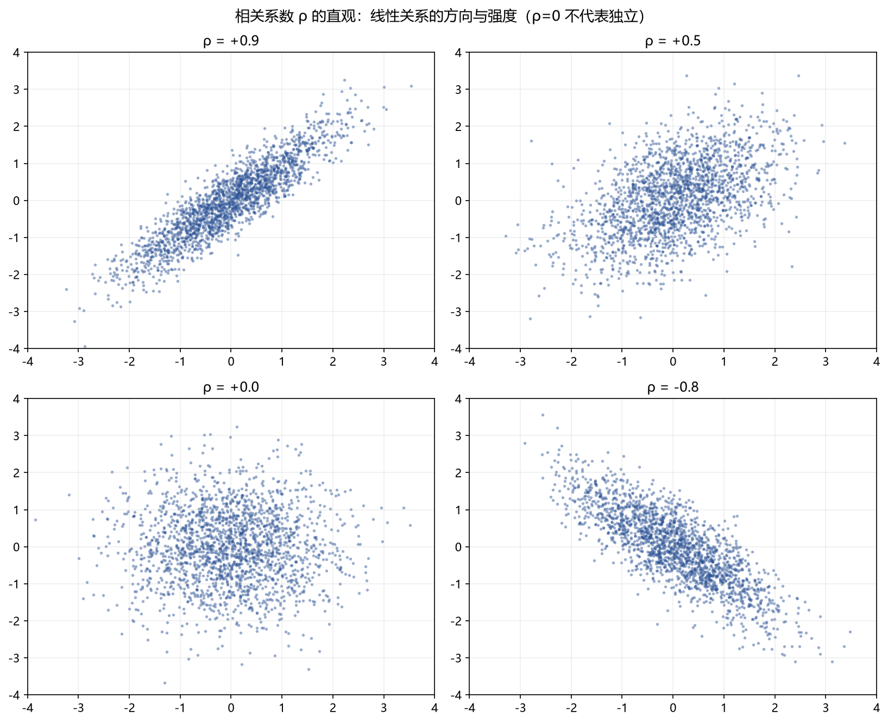

# 05 联合分布、协方差与条件期望

> 面试权重：★★★☆☆（买方进阶必考）｜ 难度：高 ｜ 来源：[S2 Q7][S7] Blitzstein & Hwang Ch7-9、Grinold & Kahn
> 定位：从"单个随机变量"进入"多个变量"——组合风险、因子相关性、条件期望都在这里。

## 一、教学

### 1.1 联合分布与边缘分布

**定义（联合密度）**：(X,Y) ~ f(x,y)，边缘密度

$$f_X(x) = \int_{-\infty}^{\infty} f(x,y)\,dy, \qquad f_Y(y) = \int_{-\infty}^{\infty} f(x,y)\,dx$$

> 注：联合分布可以推出边缘分布；边缘分布推不出联合分布。

### 1.2 独立性

**定义**：X, Y 独立 ⇔ 联合 = 边缘之积：

$$f(x,y) = f_X(x)\,f_Y(y) \iff F(x,y) = F_X(x)\,F_Y(y)$$

等价条件：E[g(X)h(Y)] = E[g(X)]E[h(Y)]。

### 1.3 协方差与相关系数

**定义**：

$$\mathrm{Cov}(X,Y) = E[XY] - E[X]E[Y], \qquad \rho = \frac{\mathrm{Cov}(X,Y)}{\sigma_X \sigma_Y} \in [-1,1]$$

> 注：ρ 只度量**线性**关系；独立 → 不相关，但反过来不成立：**不相关并不蕴含独立**（例：X ~ U(-1,1)，Y=X²）。

### 1.4 条件分布与条件期望

**定义**：

$$f_{X|Y}(x|y) = \frac{f(x,y)}{f_Y(y)}, \qquad E[X|Y=y] = \int x\, f_{X|Y}(x|y)\,dx$$

E[X|Y] 是 Y 的函数（随机变量）。

### 1.5 三大定律（必背）

**迭代期望**：

$$E[X] = E\big[E[X|Y]\big]$$

**全方差公式**：

$$\mathrm{Var}(X) = E\big[\mathrm{Var}(X|Y)\big] + \mathrm{Var}\big(E[X|Y]\big)$$

**Wald 方程**（N 独立于 Xᵢ，S = Σ(i=1..N) Xᵢ）：

$$E[S] = E[N]\,E[X], \qquad \mathrm{Var}(S) = E[N]\,\mathrm{Var}(X) + \mathrm{Var}(N)\,\big(E[X]\big)^2$$

### 1.6 次序统计量

X₁,…,Xₙ 独立 U(0,1)，最大值 X₍ₙ₎：

$$F_{X_{(n)}}(x) = x^n, \qquad E[X_{(n)}] = \int_0^1 (1-x^n)\,dx = \frac{n}{n+1}$$

## 二、例题精讲

**例 1｜两资产组合方差**

σ₁ = σ₂ = 20%，ρ = 0.5，等权：

$$\sigma_p^2 = 0.25(0.2)^2 + 0.25(0.2)^2 + 2(0.25)(0.5)(0.2)(0.2) = 0.03$$

$$\sigma_p = \sqrt{0.03} \approx 17.3\% < 20\% \quad \Rightarrow \quad \text{分散化}$$

**例 2｜随机数量之和（Wald）**

N ~ Poisson(λ)，Xᵢ iid 且独立于 N：

$$E[S] = \lambda E[X], \qquad \mathrm{Var}(S) = \lambda E[X^2]$$

**例 3｜条件期望简化计算**

掷骰子得 N，再掷 N 次硬币，正面数为 X：

$$E[X] = E\big[E[X|N]\big] = E[N/2] = \frac{7}{4}$$

$$\mathrm{Var}(X) = E[N/4] + \mathrm{Var}(N/2) = \frac{35}{24} + \frac{35}{48} = \frac{35}{16}$$

## 三、面试题

**热身**

1. 独立一定不相关，反过来？ → 否（Y = X² 例）。
2. Cov(X,Y)=0 与 Var(X+Y)=Var(X)+Var(Y) 的关系？ → 等价。

**核心**

3. ρ=0.5 两资产等权组合波动（各 20%）？ → ≈17.3%。
4. E[E[X|Y]]？ → 迭代期望，等于 E[X]。
5. n 个 U(0,1) 的最大值期望？ → n/(n+1)。

**进阶**

6. 全方差公式的应用？ → 例 3（随机个数之和）。
7. 相关正态之和？ → 仍正态，均值方差用线性组合公式。
8. 为什么因子间看 IC 相关性？ → 高相关因子叠加提升有限（Grinold & Kahn 去冗余）。

## 四、参考

- [S7] Blitzstein & Hwang Ch7-9；Grinold & Kahn（IC/组合风险）
- [S2] awesome-quant-interview Q7（协方差矩阵）
