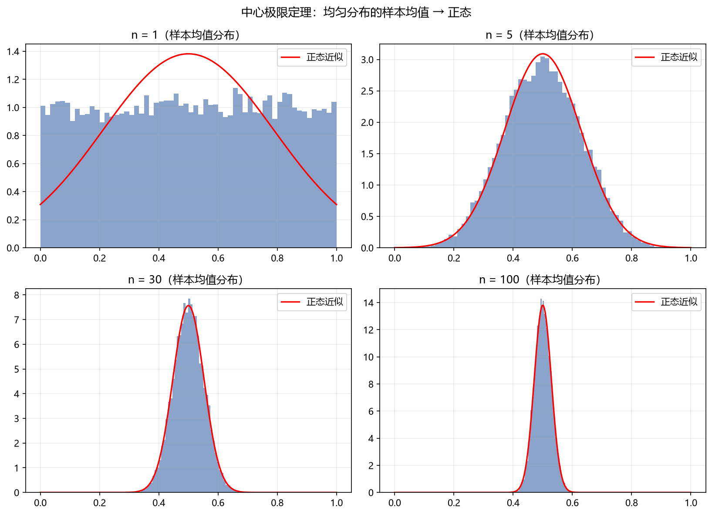

# 06 大数定律与中心极限定理

> 面试权重：★★★★☆ ｜ 难度：中 ｜ 来源：[S2 Q2][S7] Blitzstein & Hwang Ch5
> 定位：一切显著性检验的理论根基——IC 的 t 统计、回测置信区间、Monte Carlo 收敛全靠它。

## 一、教学

### 1.1 大数定律（LLN）

**定理**：$X_1,\dots,X_n$ 独立同分布，$E[X_i]=\mu$，则样本均值依概率收敛到 $\mu$：

$$\bar{X}_n = \frac{X_1 + \cdots + X_n}{n} \ \xrightarrow{p} \ \mu$$

> 频率学派"概率 = 频率极限"的理论依据。

### 1.2 中心极限定理（CLT）

**定理**：独立同分布、方差 $\sigma^2$ 有限，则

$$\frac{\bar{X}_n - \mu}{\sigma/\sqrt{n}} \ \Rightarrow \ N(0,1)$$

> 注：哪怕原始分布是均匀/指数/偏态，样本均值分布也会迅速变正态——这是"几乎处处用正态近似"的依据，也是"必须检查样本量够不够"的原因。

### 1.3 标准误与置信区间

**定义（标准误）**：

$$\mathrm{SE} = \frac{\sigma}{\sqrt{n}}$$

**置信区间**：

$$\bar{X} \pm z_{\alpha/2}\,\frac{\sigma}{\sqrt{n}}, \qquad \text{如 } z_{0.025} = 1.96$$

### 1.4 在量化里的直接应用：IC 的 t 统计

对 $T$ 期 IC 序列 $\{IC_1,\dots,IC_T\}$，检验"IC 显著非零"：

$$t = \frac{\overline{IC}}{\hat\sigma_{IC}/\sqrt{T}} = \frac{\text{mean}(IC) \times \sqrt{T}}{\text{std}(IC)}$$

$|t| > 2$ 才认为因子显著——这一行就是 CLT + 假设检验。

## 二、例题精讲

**例 1｜抛 100 次硬币**

正面比例 $\bar{X} \sim N\big(0.5,\ 0.5^2/100\big)$：

$$P(0.4 < \bar{X} < 0.6) \approx 95.4\% \quad (\pm 2\,\mathrm{SE})$$

**例 2｜样本量翻倍的效果**

$$\mathrm{SE} \propto \frac{1}{\sqrt{n}} \ \Rightarrow \ n \to 4n,\ \mathrm{SE} \to \frac{\mathrm{SE}}{2}$$

**例 3｜Monte Carlo 收敛**

模拟误差 $\sim \sigma/\sqrt{n}$：想精度提高 10 倍，模拟次数 ×100。

## 三、面试题

**热身**

1. 抛 100 次硬币正面比例的近似分布？ → $N(0.5,\ 0.0025)$。
2. 标准误是什么？ → 样本均值的标准差 $\sigma/\sqrt{n}$。

**核心**

3. 为什么 IC 检验用 $t = \text{mean}\cdot\sqrt{T}/\text{std}$？ → CLT：大样本下均值统计量近似正态。
4. 样本量 ×4，置信区间宽度？ → 减半。
5. 日波动 1%，252 日年化？ → $15.9\%$。

**进阶**

6. 厚尾数据用 CLT 的风险？ → 收敛慢；方差不存在（柯西）不收敛。
7. 序列相关时怎么办？ → bootstrap / HAC（Newey-West）标准误。
8. CLT 需要 i.i.d. 吗？ → 弱依赖（mixing）也成立，但标准误要修正。

## 四、参考

- [S2] awesome-quant-interview Q2（LLN/CLT）
- [S7] Blitzstein & Hwang Ch5；绿皮书 CLT 题
