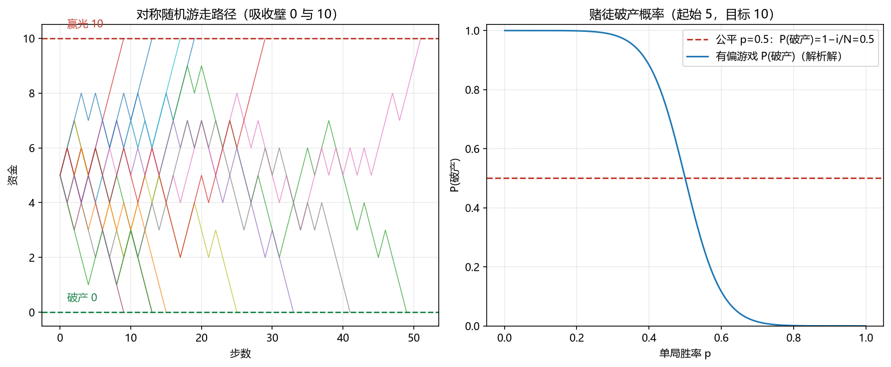

# 07 随机游走与鞅

> 面试权重：★★★☆☆（对冲基金/自营高频）｜ 难度：高 ｜ 来源：[S7] 绿皮书；Tsay（随机过程章）
> 定位：从"静态概率"到"动态过程"。赌徒破产、公平游戏、期权对冲直觉都在这里。

## 一、教学

### 1.1 简单随机游走

**定义**：$S_0 = i$，每步 $\epsilon_k \in \{-1, +1\}$，$P(+1)=p$：

$$S_n = S_0 + \sum_{k=1}^{n} \epsilon_k$$

**期望与方差**：

$$E[S_n] = S_0 + n(2p-1), \qquad \mathrm{Var}(S_n) = 4np(1-p)$$

对称游走（$p=1/2$）：$E[S_n] = S_0$，但 $\sigma_{S_n} = \sqrt{n}$——期望不动，波动按 $\sqrt{n}$ 扩散。

### 1.2 鞅（Martingale）

**定义**：给定全部历史 $\mathcal{F}_n$，

$$E[S_{n+1} \mid \mathcal{F}_n] = S_n$$

即"已知现在，未来期望不赚不亏"——公平游戏就是鞅。

**可选停时**：有界停时 $\tau$ 下

$$E[S_\tau] = E[S_0]$$

> 注：期权定价/对冲的本质就是"构造鞅"（风险中性测度下）。

### 1.3 赌徒破产

起始资金 $i$，目标 $N$，单局胜率 $p$，$q=1-p$：

$$\text{公平 } p=\tfrac{1}{2}: \qquad P(\text{赢到 } N) = \frac{i}{N}, \qquad P(\text{破产}) = 1 - \frac{i}{N}$$

$$p \neq \tfrac{1}{2}: \qquad P(\text{破产}) = \frac{(q/p)^{N} - (q/p)^{i}}{(q/p)^{N} - 1}$$

## 二、例题精讲

**例 1｜公平游戏 5 → 10**

$$P(\text{到 }10) = \frac{5}{10} = \frac{1}{2}, \qquad P(\text{破产}) = \frac{1}{2}$$

**例 2｜有偏 $p = 0.6$，起始 5，目标 10**

$$\frac{q}{p} = \frac{2}{3} \ \Rightarrow \ P(\text{破产}) = \frac{(2/3)^{10} - (2/3)^{5}}{(2/3)^{10} - 1} \approx 0.083$$

微小优势 → 破产概率骤降（赌场只赚一点也稳赢的原因）。

**例 3｜对称游走 100 步**

$$E[S_{100}] = 0, \qquad \sigma = \sqrt{100} = 10 \ \Rightarrow \ P(|S_{100}| > 20) \approx 4.6\%$$

## 三、面试题

**热身**

1. 对称游走 10 步的期望位置与方差？ → 0 与 10。
2. 鞅的定义？ → $E[S_{n+1}|\mathcal{F}_n] = S_n$。

**核心**

3. 公平游戏 5 元赌到 10 元，破产概率？ → $1/2$。
4. 为什么 $p = 0.51$ 就"稳赢"？ → 破产概率指数级下降（公式代入）。
5. 对称游走首次回到 0 的期望时间？ → 无穷（虽必然返回）。

**进阶**

6. 用可选停时证明公平游戏？ → $E[S_\tau] = E[S_0]$。
7. 反射原理？ → 首次到达 $a$ 后的路径与反射路径一一对应 → 首达时间分布。
8. 鞅与期权？ → 对冲使组合价值在风险中性测度下为鞅 → 期望即价格。

## 四、参考

- [S7] 绿皮书随机过程题；Tsay《Analysis of Financial Time Series》Ch1-2
- 模拟代码见 [make_figures.py](make_figures.py)（gamblers_ruin 面板）
