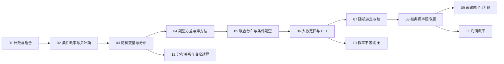

# 01_probability · 概率与组合（面试第一关）

> 为什么先学它：绿皮书《A Practical Guide to Quantitative Finance Interviews》约一半篇幅是概率；买方 QS/QA 第一轮几乎必考概率题。
> 目标：从"看得懂公式"到"能 2 分钟白板讲清推导"。
> 公式风格：全部使用 LaTeX（`$...$` / `$$...$$`），GitHub 直接渲染；每章按"教学 → 例题精讲 → 面试题 → 参考"组织。

## 学习路径

## 面试权重

| 主题 | 出现频率 | 难度 | 说明 |
| --- | --- | --- | --- |
| 01 计数与组合 | ★★★★☆ | 低→中 | 快题、事件空间分母 |
| 02 条件概率与贝叶斯 | ★★★★★ | 中 | **几乎必考** |
| 03 随机变量与分布 | ★★★★☆ | 中 | 期望方差必背 |
| 04 期望方差与矩方法 | ★★★★★ | 中→高 | 指示变量/线性期望技巧 |
| 05 联合分布与条件期望 | ★★★☆☆ | 高 | 买方进阶 |
| 06 LLN / CLT | ★★★★☆ | 中 | t 统计的理论根基 |
| 07 随机游走与鞅 | ★★★☆☆ | 高 | 对冲基金/自营爱考 |
| 08 经典专题 | ★★★★★ | 中→高 | 生日/Monty Hall/赌徒破产/秘书问题 |
| 09 题卡 | — | — | 48 题，考前 2 小时刷 |
| 10 概率不等式 | ★★★★☆ | 中→高 | Markov/Chebyshev/Chernoff，量化必用 |
| 11 几何概率 | ★★★☆☆ | 中 | 断棍/Buffon 针，绿皮书常考 |
| 12 分布关系与泊松过程 | ★★★☆☆ | 高 | Gamma/χ²/t/F 链条、泊松过程 |

## 文件

- [01_计数与组合.md](01_计数与组合.md) —— 排列组合、鸽笼、容斥、错排
- [02_条件概率与贝叶斯.md](02_条件概率与贝叶斯.md) —— 贝叶斯公式 + 信号更新 + 贝叶斯树图
- [03_随机变量与分布.md](03_随机变量与分布.md) —— 8 离散/连续分布 + 分布对比图
- [04_期望方差与矩方法.md](04_期望方差与矩方法.md) —— 线性期望、指示变量、对称性
- [05_联合分布协方差与条件期望.md](05_联合分布协方差与条件期望.md) —— 组合方差、迭代期望、次序统计量
- [06_大数定律与中心极限定理.md](06_大数定律与中心极限定理.md) —— LLN/CLT + IC t 统计 + 收敛模拟图
- [07_随机游走与鞅.md](07_随机游走与鞅.md) —— 赌徒破产、可选停时 + 模拟图
- [08_经典概率题专题.md](08_经典概率题专题.md) —— 11 道高频原题精讲（含秘书问题）
- [09_面试题卡.md](09_面试题卡.md) —— 48 题分组刷 + 考前检查清单
- [10_概率不等式.md](10_概率不等式.md) —— Markov / Chebyshev / Chernoff
- [11_几何概率.md](11_几何概率.md) —— 断棍、Buffon 针、随机几何
- [12_分布关系与泊松过程.md](12_分布关系与泊松过程.md) —— Gamma/χ²/t/F 链条、泊松过程

## 配图（assets/）

10 张教学图：连续/离散分布对比、PDF/CDF、正态 68-95-99.7、无记忆性、贝叶斯树、CLT 收敛、次序统计量、相关系数散点、赌徒破产——可用 `make_figures.py` 重新生成。

## 来源

- [S1] k3vv0/quant_interview_prep（Combinatorics / Probability，每题带代码）
- [S2] awesome-quant-interview（Q1 贝叶斯、Q2 LLN/CLT、Q7 协方差）
- [S7] 绿皮书（Zhou）、Heard on the Street、Joshi、Blitzstein & Hwang、Tsay
