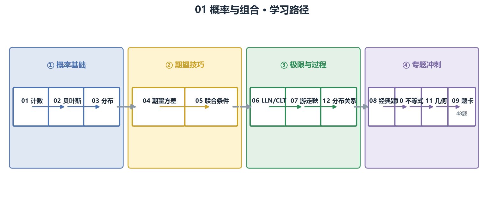

# 🎲 01_probability · 概率与组合

QS/QA 面试第一关：绿皮书约一半篇幅是概率，买方第一轮几乎必考。

> 目标：从"看得懂公式"到"能 2 分钟白板讲清推导"。
> 公式规范：独立公式用 LaTeX 渲染，正文用 Unicode，无乱码。

## 🎯 定位

概率是量化面试的**入场券**：计数、贝叶斯、分布、期望技巧、CLT、随机游走/鞅、经典悖论，全部是高频题。每一章按"教学（概念 + 图）→ 例题精讲 → 面试题（热身/核心/进阶）→ 参考"组织。

## 🗺️ 学习路径

## 📚 章节地图

| # | 章节 | 核心主题 | 链接 |
| --- | --- | --- | --- |
| 01 | 计数与组合 | 排列组合、鸽笼、容斥、错排 | [打开](01_计数与组合.md) |
| 02 | 条件概率与贝叶斯 | 贝叶斯公式、信号更新、贝叶斯树 | [打开](02_条件概率与贝叶斯.md) |
| 03 | 随机变量与分布 | 8 种离散/连续分布、无记忆性 | [打开](03_随机变量与分布.md) |
| 04 | 期望方差与矩方法 | 线性期望、指示变量、对称性 | [打开](04_期望方差与矩方法.md) |
| 05 | 联合分布与条件期望 | 组合方差、迭代期望、次序统计量 | [打开](05_联合分布协方差与条件期望.md) |
| 06 | 大数定律与 CLT | IC t 统计、收敛模拟 | [打开](06_大数定律与中心极限定理.md) |
| 07 | 随机游走与鞅 | 赌徒破产、可选停时 | [打开](07_随机游走与鞅.md) |
| 08 | 经典概率题专题 | 生日/Monty Hall/赌徒破产/秘书问题 | [打开](08_经典概率题专题.md) |
| 09 | 面试题卡 | 48 题分组刷 + 考前清单 | [打开](09_面试题卡.md) |
| 10 | 概率不等式 | Markov / Chebyshev / Chernoff | [打开](10_概率不等式.md) |
| 11 | 几何概率 | 断棍、Buffon 针、随机几何 | [打开](11_几何概率.md) |
| 12 | 分布关系与泊松过程 | Gamma/χ²/t/F 链条、泊松过程 | [打开](12_分布关系与泊松过程.md) |

## 📊 面试权重

| 主题 | 频率 | 难度 | 说明 |
| --- | --- | --- | --- |
| 01 计数与组合 | ★★★★☆ | 低→中 | 快题、事件空间分母 |
| 02 条件概率与贝叶斯 | ★★★★★ | 中 | **几乎必考** |
| 03 随机变量与分布 | ★★★★☆ | 中 | 期望方差必背 |
| 04 期望方差与矩方法 | ★★★★★ | 中→高 | 指示变量/线性期望技巧 |
| 05 联合分布与条件期望 | ★★★☆☆ | 高 | 买方进阶 |
| 06 LLN / CLT | ★★★★☆ | 中 | t 统计的理论根基 |
| 07 随机游走与鞅 | ★★★☆☆ | 高 | 对冲基金/自营爱考 |
| 08 经典专题 | ★★★★★ | 中→高 | 高频原题精讲 |
| 09 题卡 | — | — | 考前 2 小时刷 |
| 10 概率不等式 | ★★★★☆ | 中→高 | 量化必用 |
| 11 几何概率 | ★★★☆☆ | 中 | 绿皮书常考 |
| 12 分布关系与泊松过程 | ★★★☆☆ | 高 | 面试进阶 |

## 🖼️ 配图（assets/）

连续/离散分布对比、PDF/CDF、正态 68-95-99.7、无记忆性、贝叶斯树、CLT 收敛、次序统计量、相关系数散点、赌徒破产——`make_figures.py` 可重新生成。

## 📜 来源

- [S1] k3vv0/quant_interview_prep（Combinatorics / Probability，每题带代码）
- [S2] awesome-quant-interview（Q1 贝叶斯、Q2 LLN/CLT、Q7 协方差）
- [S7] 绿皮书（Zhou）、Heard on the Street、Joshi、Blitzstein & Hwang、Tsay
