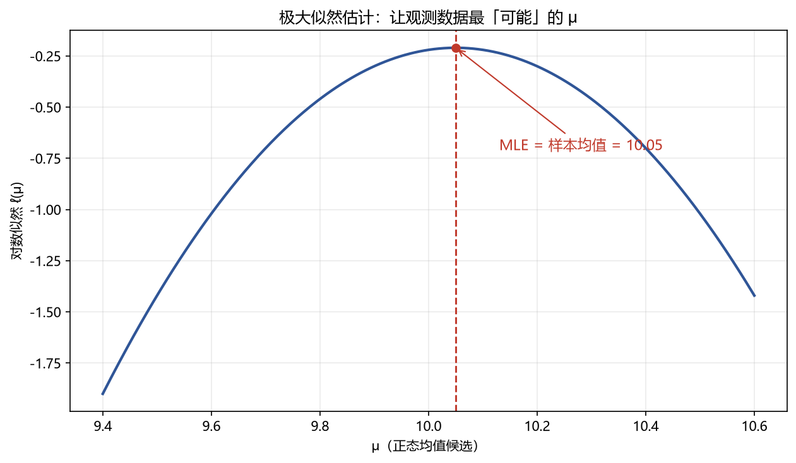

# 01 参数估计（MLE 与置信区间）

> 面试权重：★★★★☆ ｜ 难度：中 ｜ 来源：[S2 Q5][S6][S7]
> 定位：所有统计检验的地基——先把参数"估"对，才有后面"判显著"。

## 一、教学

### 1.1 点估计 vs 区间估计

- **点估计**：用一个数估计参数，如用样本均值估计总体均值。
- **区间估计**：给出一个区间（置信区间），量化估计的不确定性。

### 1.2 矩估计（MoM）

令样本矩 = 总体矩，解出参数。例：正态 N(μ,σ²)，一阶矩 → μ̂ = x̄，二阶矩 → σ̂² = 样本二阶中心矩。

### 1.3 极大似然估计（MLE）★

**定义**：选择让观测数据"最可能"出现的参数：

$$L(\theta) = \prod_{i=1}^{n} f(x_i; \theta), \qquad \hat\theta_{MLE} = \arg\max_\theta L(\theta)$$

通常最大化对数似然（乘积变求和，数值更稳）：

$$\ell(\theta) = \sum_{i=1}^{n} \ln f(x_i; \theta)$$

**MLE 的三大性质（面试背）**：

- **一致性**：n → ∞ 时收敛到真值
- **渐近正态**：√n(θ̂−θ) ⇒ N(0, I(θ)⁻¹)
- **有效性**：达到 Cramér–Rao 下界（信息量 I(θ) 的倒数）

### 1.4 GMM（一句话）

矩条件 E[g(X,θ)] = 0，用样本矩近似并最小化加权距离——当 MLE 的分布假设不可靠时的替代。

### 1.5 置信区间

**定义**：重复抽样下，区间覆盖真值的比例是 1−α：

$$\bar{x} \pm z_{\alpha/2}\,\frac{\sigma}{\sqrt{n}} \qquad \text{方差已知}$$

$$\bar{x} \pm t_{\alpha/2,\,n-1}\,\frac{s}{\sqrt{n}} \qquad \text{方差未知（用 t）}$$

> 注：95% 置信区间**不是**"真值有 95% 概率落在区间里"——真值固定，随机的是区间。

## 二、例题精讲

**例 1｜正态均值的 MLE = 样本均值**

$$\hat\mu = \arg\max_\mu -\frac{1}{2\sigma^2}\sum (x_i-\mu)^2 = \bar{x}$$

对 μ 求导置零，一阶条件直接给出样本均值。

**例 2｜伯努利 p 的 MLE = 样本比例**

$$L(p) = p^{\sum x_i}(1-p)^{n-\sum x_i} \ \Rightarrow \ \hat p = \frac{\sum x_i}{n}$$

**例 3｜未知方差的均值置信区间**

样本 n=25，x̄=10，s=2：

$$\bar{x} \pm t_{0.025,24}\,\frac{s}{\sqrt{25}} = 10 \pm 2.064 \times 0.4 \approx [9.17,\ 10.83]$$

## 三、面试题

**热身**

1. MLE 的步骤？ → 写似然 → 取对数 → 求导置零（或数值优化）。
2. 为什么用对数似然？ → 乘积变求和，数值稳定。

**核心**

3. 正态均值 MLE？ → 样本均值（一阶条件）。
4. 置信区间的正确解释？ → 重复抽样下覆盖率 95%，不是"参数的概率"。
5. 方差未知为什么用 t？ → 额外估计了 σ，尾部更肥。

**进阶**

6. MLE 的渐近性质？ → 一致、渐近正态、有效（Cramér–Rao）。
7. GMM 与 MLE 区别？ → GMM 只要矩条件，不假设完整分布。

## 四、参考

- [S2] awesome-quant-interview Q5（MLE/GMM）
- [S7] Blitzstein & Hwang Ch10；绿皮书统计章节
