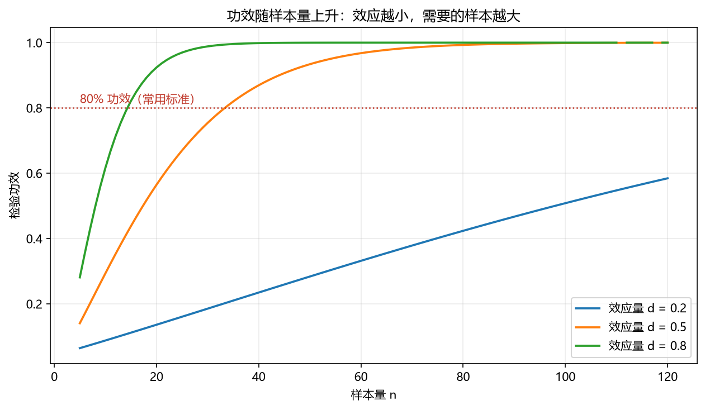
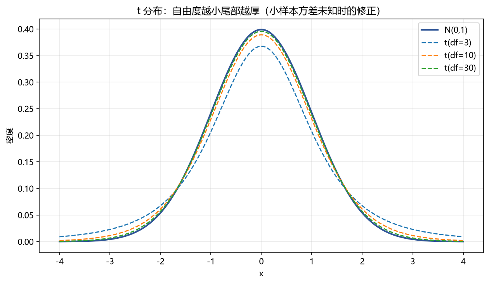

# 02 假设检验（p 值与功效）

> 面试权重：★★★★★ ｜ 难度：中 ｜ 来源：[S1][S2 Q6][S3 T1][S6]
> 定位：量化研究每天在用——"这个因子的 IC 显著吗"就是一次假设检验。

## 一、教学

### 1.1 检验框架

**零假设 H₀**：默认状态（如"IC 的均值为 0"）。

**备择假设 H₁**：想证明的（如"IC 的均值 ≠ 0"）。

**流程**：构造检验统计量 → 算 p 值 → p < α 则拒绝 H₀。

### 1.2 两类错误

| | H₀ 为真 | H₀ 为假 |
| --- | --- | --- |
| 不拒绝 H₀ | ✓ | **II 类错误**（漏报） |
| 拒绝 H₀ | **I 类错误**（误报，概率 = α） | ✓ |

**功效（Power）** = 1 − P(II 类错误) = H₁ 为真时正确拒绝的概率。

> 注：显著性 α 控制"误报"，功效控制"漏报"——样本量越大，两者都能改善。

### 1.3 常用检验

| 检验 | 用途 | 统计量 |
| --- | --- | --- |
| z 检验 | 方差已知，均值 | z = (x̄−μ₀)/(σ/√n) |
| t 检验 | 方差未知，均值 | t = (x̄−μ₀)/(s/√n) |
| 卡方检验 | 方差、拟合优度 | χ² = (n−1)s²/σ₀² |
| F 检验 | 两组方差比、回归整体 | F = 方差比 |

### 1.4 p 值的正确定义

**定义**：在 H₀ 为真的前提下，观测到"当前或更极端"结果的概率。

> 注：p 值不是"H₀ 为真的概率"；p=0.03 是说"如果因子其实无效，随机跑出这么强 IC 的概率是 3%"。

## 二、例题精讲

**例 1｜因子 IC 的 t 检验（量化最常用）**

T=60 期，mean(IC)=0.04，std(IC)=0.12：

$$t = \frac{0.04}{0.12/\sqrt{60}} = \frac{0.04 \times 7.75}{0.12} \approx 2.58$$

\|t\| > 2 → 拒绝"IC=0"，因子显著（近似 5% 水平）。

**例 2｜均值检验**

策略日均收益 0.05%，日波动 0.8%，n=100：t = 0.05/(0.8/10) = 0.625，不显著。

**例 3｜功效计算**

想以 80% 功效检测到 d=0.3 的效应（α=0.05）：需要 n ≈ (z₀.₉₇₅+z₀.₈)²/d² ≈ (1.96+0.84)²/0.09 ≈ 87 天。

## 三、面试题

**热身**

1. p 值的定义？ → H₀ 下出现当前或更极端结果的概率。
2. I 类错误概率叫什么？ → α（显著性水平）。

**核心**

3. 为什么 |t|>2 近似显著？ → t 近似正态，|z|>1.96 的双侧 α≈5%。
4. 功效怎么提高？ → 增大样本、增大效应、放宽 α。
5. 置信区间与检验的关系？ → 区间不含 H₀ 值 ⇔ 拒绝 H₀（双侧 5% 对应 95% 区间）。

**进阶**

6. 多重检验下 p 值还可靠吗？ → 不可靠，见 05 章。
7. 金融数据用 t 检验要注意什么？ → 序列相关/异方差 → 用 HAC 标准误（03 章）。

## 四、参考

- [S2] awesome-quant-interview Q6（p 值）
- [S3] Topic 1（稳健标准误与 OLS）
- [S7] Blitzstein & Hwang Ch10；绿皮书
