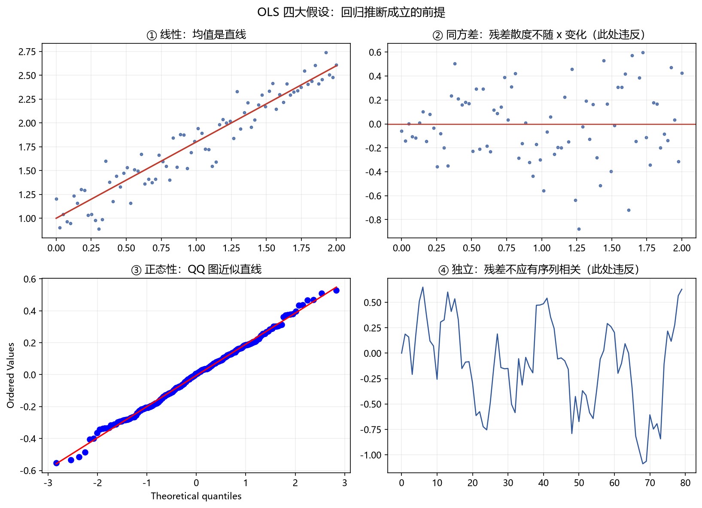

# 03 回归推断（OLS 与 Fama-MacBeth）

> 面试权重：★★★★★ ｜ 难度：中→高 ｜ 来源：[S2 Q33][S3 T1/T4][S7] 石川《因子投资》
> 定位：因子研究的"工作语言"——收益对因子回归，系数就是因子溢价。

## 一、教学

### 1.1 线性回归模型

$$y_i = \beta_0 + \beta_1 x_{1i} + \cdots + \beta_k x_{ki} + \varepsilon_i$$

OLS 估计：最小化残差平方和，解为 β̂ = (X′X)⁻¹X′y。

### 1.2 OLS 四大假设（必背）

1. **线性**：均值是 X 的线性函数
2. **独立**：残差 ε 相互独立（金融数据常违反 → 自相关）
3. **同方差**：Var(ε) 常数（金融数据常违反 → 异方差）
4. **正态性**：ε ~ N(0, σ²)（大样本下可放松，靠 CLT）

> 假设 2、3 被违反时，标准误算错 → t 检验失效 → 需要稳健标准误。

### 1.3 多重共线性

自变量高度相关 → 系数估计方差爆炸、符号不稳。

**诊断**：VIF（方差膨胀因子），VIF > 10 视为严重。

### 1.4 稳健标准误

- **异方差** → HC（White）标准误
- **异方差 + 自相关** → HAC（Newey–West）标准误
- 量化里回报回归几乎默认用 HAC——序列重叠（预测期 > 频率）时尤其重要

### 1.5 Fama-MacBeth（横截面因子检验标准工具）★

**两步法**：

1. **时序回归**：对每个股票 i 回归因子暴露 βᵢ（滚动窗口）
2. **截面回归**：每期 t 用收益对 β 回归，得到因子溢价 λₜ；再对 λₜ 序列做 t 检验

$$\lambda = \frac{1}{T}\sum_{t}\lambda_t, \qquad t = \frac{\bar\lambda}{\hat\sigma_\lambda/\sqrt{T}}$$

> 优点：自动处理截面相关性（每期只用一个截面），是学术界检验因子溢价的标准方法。

## 二、例题精讲

**例 1｜单因子回归的 t 检验**

收益对动量因子回归，β̂=0.8，SE(β̂)=0.25 → t=3.2，显著。

**例 2｜Fama-MacBeth 流程**

100 只股票、60 个月：①每只股票前 36 个月回归得 βᵢ ②每个月截面回归得 λₜ ③60 个 λₜ 的 t 检验 → 判断因子是否被定价。

**例 3｜什么时候必须用 HAC**

用月频收益预测 12 个月持有期 → 重叠样本 → 残差自相关 → 普通 SE 低估 → Newey–West 修正。

## 三、面试题

**热身**

1. OLS 估计公式？ → β̂ = (X′X)⁻¹X′y。
2. R² 含义？ → 被解释的方差比例。

**核心**

3. 共线性为什么危险？ → 系数方差爆炸、解释不可靠（VIF 诊断）。
4. 异方差/自相关怎么处理？ → HC / HAC（Newey–West）标准误。
5. Fama-MacBeth 两步？ → 时序估暴露，截面估溢价，再对溢价做 t 检验。

**进阶**

6. 为什么 FM 比"直接 pooled OLS"好？ → 处理截面相关与误差结构。
7. 因子相关性高怎么办？ → 去冗余（05 章多重检验 + 聚类）。

## 四、参考

- [S3] Empirical Method Topic 1（稳健 SE）、Topic 4（Fama-MacBeth/PCA）
- [S7] 石川《因子投资》回归与 FM 章节；Tsay 回归章
