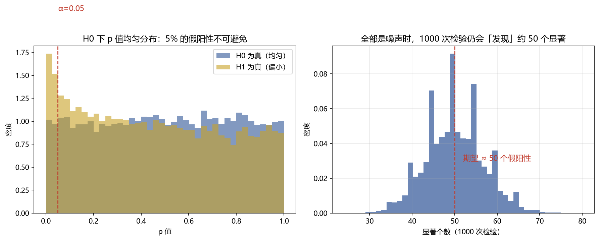

# 05 多重检验 ★（Bonferroni / BH-FDR / t≥3）

> 面试权重：★★★★☆ ｜ 难度：高 ｜ 来源：[S2 因子工厂][S4 Ch7][S5][S7] Harvey-Liu-Zhu (2016)
> 定位：从 02 走向 04 的"桥梁"——大量检验时，p 值会撒谎。

## 一、教学

### 1.1 问题：假阳性膨胀

测 1000 个随机因子，α=0.05 → 期望 1000×0.05 = **50 个假阳性**。p 值只承诺"单次检验的误报率"。

> 直觉：H₀ 下 p 值均匀分布，总会有一批恰好小于 0.05——"显著"不等于"真实"。

### 1.2 控制族系错误率（FWER）

**Bonferroni**：显著阈值 α/N（N 为检验数），保守但简单。

**Holm**：排序 p 值逐步校正，比 Bonferroni 松一点，仍控制 FWER。

### 1.3 控制错误发现率（FDR）

**BH（Benjamini-Hochberg）**：允许一定比例的假阳性（通常 q=0.05/0.10）：

1. 把 N 个 p 值排序 p(1) ≤ ... ≤ p(N)
2. 找最大的 k 使 p(k) ≤ (k/N)·q
3. 拒绝前 k 个

> 学术因子研究现在主流用 FDR——它比 Bonferroni 功效高，适合"从几百个候选中挑"。

### 1.4 Harvey-Liu-Zhu：t ≥ 3 规则 ★

因子动物园论文（2016）：历史上"显著"因子 t 值分布整体右移——因为被数据挖掘筛选过。结论：

$$t > 3.0 \quad (\text{约 } p < 0.003)$$

才算"令人惊讶"的发现；同时建议把"该因子所在文献族"当先验。

### 1.5 与回测严谨性的衔接

单因子 t=2.5 只是起点；要考虑：

- 试了多少个因子（有效试验数 N）
- 参数搜索（Deflated Sharpe，04 模块）
- 样本外验证（purged CV，04 模块）

## 二、例题精讲

**例 1｜1000 个随机策略**

α=0.05 → 期望 50 个显著；Bonferroni 阈值 0.00005；BH 按排序逐步放宽。面试答"大概 50 个，所以必须校正"就过关。

**例 2｜BH 手算**

10 个 p 值，q=0.10：阈值线 (k/10)×0.10，最大的满足 p(k) ≤ 阈值线的 k 即为拒绝数。

**例 3｜t=3 的由来**

同一因子在多个数据集/变体上反复测试后，t=2 不再可信 → 提高到 3（Harvey-Liu-Zhu 的证据）。

## 三、面试题

**热身**

1. 为什么多重检验有问题？ → 假阳性率随检验数线性累积。
2. Bonferroni 怎么做？ → α/N。

**核心**

3. FWER vs FDR 区别？ → 控制"至少一个假阳性" vs 控制"假阳性占比"。
4. 什么时候用 BH？ → 几百个候选因子，允许少量假阳性换功效。
5. t≥3 规则哪来的？ → Harvey-Liu-Zhu 因子动物园论文。

**进阶**

6. 有效试验数怎么估计？ → 相关性降低独立检验数（DSR 用 K_eff，04 模块）。
7. 因子筛选的正确流程？ → 先验筛选 → FDR 控制 → 样本外 + purged CV 确认。

## 四、参考

- [S2] 因子工厂章节（101 Alphas、Lucky Factors）
- [S4] machine-learning-for-trading Ch7（BH-FDR、DSR）
- [S5] purgedcv（MinTRL/MinBTL 与多重检验）
- [S7] Harvey, Liu & Zhu (2016), "…and the Cross-Section of Expected Returns"
