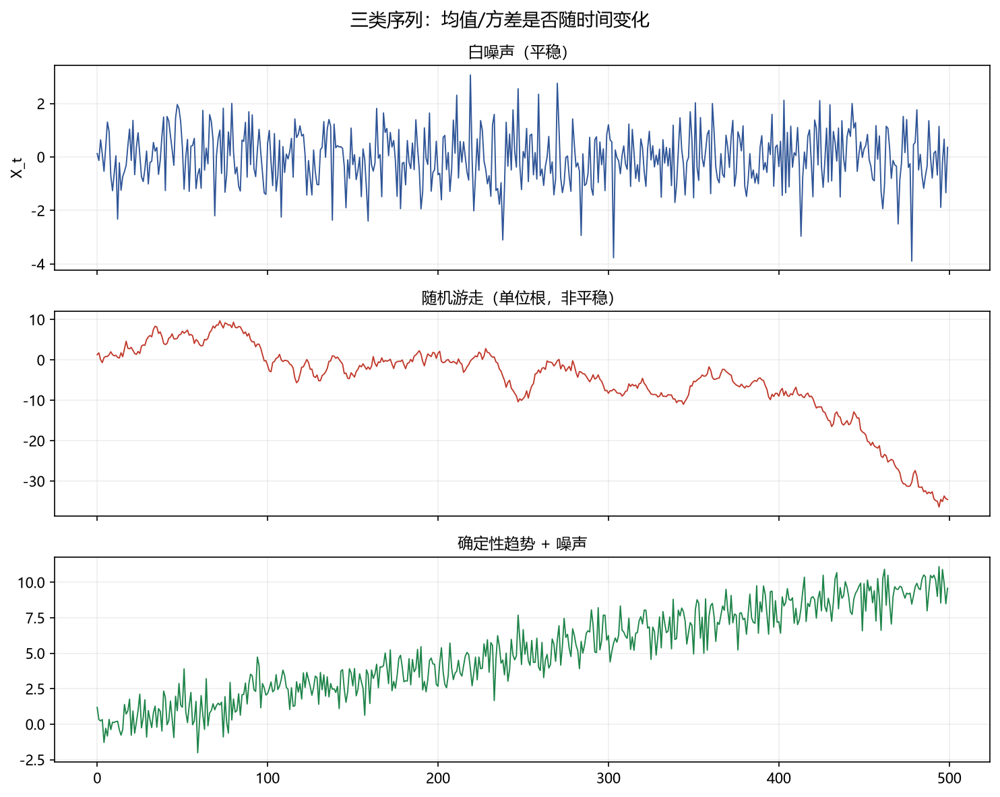

# 01 平稳性（ADF / KPSS）

> 面试权重：★★★★★ ｜ 难度：中 ｜ 来源：[S2 Q10][S3 T1][S4 Ch9]
> 定位：时间序列的第一问——"这个序列能不能用常规统计处理"，答案就是平稳性。

## 一、教学

### 1.1 定义

**严平稳**：任意时间段的联合分布不随时间平移而改变（要求太强，实操很少用）。

**弱平稳**（实操标准）：均值、方差恒定，协方差只依赖时间间隔：

$$E[X_t] = \mu, \qquad \mathrm{Var}(X_t) = \sigma^2, \qquad \mathrm{Cov}(X_t, X_{t-k}) = \gamma_k$$

### 1.2 三类序列（看图）

1. **白噪声**：平稳，均值为 0、方差恒定
2. **随机游走**：单位根，非平稳——方差随时间增长
3. **趋势 + 噪声**：均值随时间漂移，非平稳

> 直觉：价格是非平稳的（方差随时间增大），收益率近似平稳——所以建模前先看平稳性。

### 1.3 单位根与随机游走

$$X_t = X_{t-1} + \varepsilon_t \ \Leftrightarrow \ (1-L)X_t = \varepsilon_t$$

特征根 = 1 → 单位根 → 冲击不会衰减（永久效应）。

### 1.4 两个检验（H0 相反，必背）

| 检验 | H0 | 拒绝意味着 | 用途 |
| --- | --- | --- | --- |
| ADF | 有单位根（非平稳） | 平稳 | 判断"能不能直接用" |
| KPSS | 平稳 | 非平稳 | 反过来确认 |

> 注：两个一起做（单位根检验组合）：ADF 不拒绝 + KPSS 拒绝 → 非平稳；都拒绝/都不拒绝 → 数据不足或有结构断裂。

### 1.5 平稳化

一阶差分：ΔXₜ = Xₜ − Xₜ₋₁；对数差分 = 连续复利收益。

## 二、例题精讲

**例 1｜价格 vs 收益**

价格是随机游走（单位根）→ 非平稳；日收益是白噪声近似 → 平稳。所以因子研究用收益不用价格。

**例 2｜ADF 结果解读**

ADF 统计量 −3.2，5% 临界值 −2.9 → 拒绝单位根 → 序列平稳，可以做 ARMA。

**例 3｜伪回归**

两个独立随机游走回归，R² 高达 0.8——完全虚假。平稳性检验正是防这个。

## 三、面试题

**热身**

1. 弱平稳的条件？ → 均值/方差恒定，协方差只依赖间隔。
2. 随机游走为什么不平稳？ → 方差随时间线性增长。

**核心**

3. ADF 的 H0？ → 有单位根（非平稳）。
4. 价格 vs 收益？ → 价格非平稳，收益近似平稳。
5. 为什么先做平稳性检验？ → 防伪回归、选对模型。

**进阶**

6. ADF + KPSS 一起做的逻辑？ → H0 相反，交叉确认。
7. 结构断裂对检验的影响？ → 断裂可能让 ADF 误判平稳。

## 四、参考

- [S2] awesome-quant-interview Q10（平稳性）
- [S3] Empirical Method Topic 1（随机游走假说、平稳性）
- [S7] Tsay Ch1-2；statsmodels `adfuller` / `kpss`
