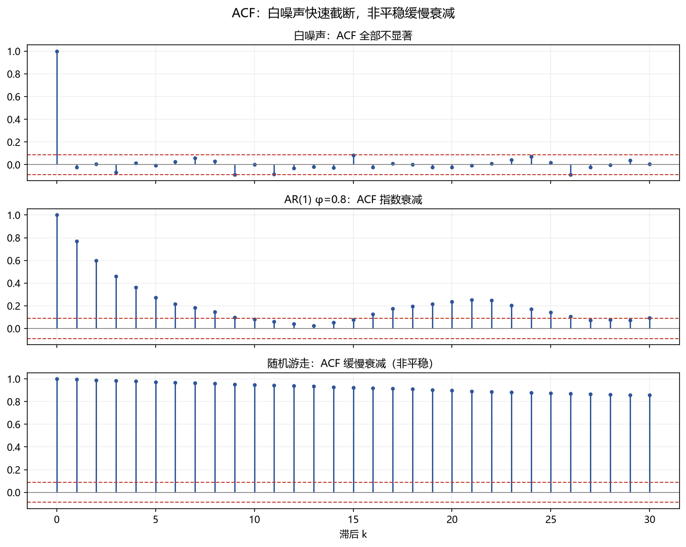

# 02 自相关（ACF / Hurst / 方差比）

> 面试权重：★★★★☆ ｜ 难度：中 ｜ 来源：[S2][S3 T2]
> 定位：回答"序列有没有记忆"——动量（正自相关）还是反转（负自相关）。

## 一、教学

### 1.1 ACF 与 PACF

**自相关函数（ACF）**：

$$\rho_k = \frac{\mathrm{Cov}(X_t, X_{t-k})}{\sqrt{\mathrm{Var}(X_t)\mathrm{Var}(X_{t-k})}}$$

**偏自相关（PACF）**：去掉中间滞后影响后的相关。

- 白噪声：ACF 全部在 ±1.96/√n 内（无记忆）
- AR(1)：ACF 指数衰减，PACF 一阶截断
- 随机游走：ACF 缓慢衰减（非平稳信号）

### 1.2 Ljung-Box 检验

**H0**：前 k 阶自相关全为 0（白噪声）。统计量：

$$Q = n(n+2)\sum_{k=1}^{K}\frac{\hat\rho_k^2}{n-k}$$

拒绝 → 序列有自相关 → 收益可预测性候选。

### 1.3 Hurst 指数

标度律 E[R(n)] ~ c·nᴴ：

- H = 0.5：随机游走
- H > 0.5：持续性（动量）
- H < 0.5：均值回复（反转）

### 1.4 方差比检验

若为随机游走，k 期方差 = k 倍单期方差：

$$\mathrm{VR}(k) = \frac{\mathrm{Var}(r_t + \cdots + r_{t-k+1})}{k\,\mathrm{Var}(r_t)}$$

VR > 1 动量；VR < 1 反转（Lo-MacKinlay 检验）。

## 二、例题精讲

**例 1｜AR(1) 的 ACF**

Xₜ = 0.8Xₜ₋₁ + εₜ → ρₖ = 0.8ᵏ：1 阶 0.8，2 阶 0.64……指数衰减。

**例 2｜用 Ljung-Box 判断动量**

月收益 12 个月 ACF 均为正且 Q 检验显著 → 存在 12 个月动量 → 与时间序列动量文献一致。

**例 3｜方差比判断反转**

周收益 VR(4) = 0.75 < 1 → 短期反转（买入超跌）。

## 三、面试题

**热身**

1. ACF 是什么？ → 滞后 k 期的自相关。
2. 白噪声 ACF？ → 全部不显著。

**核心**

3. AR(1) ACF 形态？ → 指数衰减。
4. Hurst > 0.5 意味着什么？ → 持续性/动量。
5. 方差比 < 1？ → 均值回复。

**进阶**

6. 为什么用 PACF？ → 区分 AR 与 MA 阶数。
7. 序列相关对 t 检验的影响？ → 标准误偏小 → HAC 修正（02 模块）。

## 四、参考

- [S3] Empirical Method Topic 2（自相关、预测回归）
- [S7] Tsay Ch2-3；statsmodels `acf` / `acorr_ljungbox`
