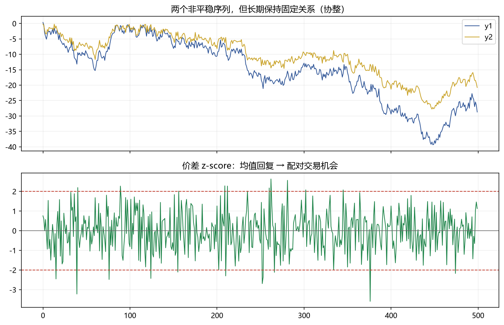

# 04 协整（Engle-Granger / Johansen）

> 面试权重：★★★★☆ ｜ 难度：高 ｜ 来源：[S2 Q12][S7] Tsay
> 定位：统计套利与多资产对冲的核心——两个非平稳序列，价差却平稳。

## 一、教学

### 1.1 定义

Xₜ、Yₜ 都是 I(1)（一阶单整），但存在 β 使：

$$Z_t = Y_t - \beta X_t \ \text{是平稳的}$$

则称 Xₜ、Yₜ 协整——长期均衡关系 + 短期偏离会均值回复。

### 1.2 Engle-Granger 两步法

1. **回归**：Yₜ = βXₜ + Zₜ，得残差（估计 β）
2. **检验**：对残差 Zₜ 做 ADF（用特殊临界值）→ 平稳则协整

### 1.3 误差修正模型（ECM）

$$ΔY_t = \alpha\,Z_{t-1} + \text{短期项} + \varepsilon_t$$

α < 0 表示偏离均衡后会被拉回（α 是回复速度）。

### 1.4 Johansen 检验

多变量、多个协整关系的推广：基于 VAR 的似然比检验，能找出协整秩 r。

### 1.5 配对交易

价差 z-score 突破 ±2 → 做多低估、做空高估 → 回归 0 平仓（见图下方）。

## 二、例题精讲

**例 1｜EG 两步**

股票 A/B 同行业：Y = 0.7X + Z；残差 ADF 拒绝单位根 → 协整 → 可做配对。

**例 2｜价差交易**

z = 2.1 → 做多价差（买低估卖高估）；z 回到 0 → 平仓获利。

**例 3｜ECM 解读**

α = −0.3：偏离 1 单位，每期拉回 0.3 单位 → 半衰期约 ln2/0.3 ≈ 2.3 期。

## 三、面试题

**热身**

1. 协整定义？ → 非平稳序列的线性组合平稳。
2. 和相关的区别？ → 相关是同期关系，协整是长期均衡。

**核心**

3. EG 两步？ → 回归取残差 → 残差 ADF。
4. ECM 的 α 含义？ → 回复速度（负值）。
5. 什么时候用 Johansen？ → 多个变量/多个协整关系。

**进阶**

6. 为什么不能直接用价格回归？ → 伪回归（两个独立随机游走）。
7. 协整在组合里的用途？ → 对冲比率 β、统计套利。

## 四、参考

- [S2] awesome-quant-interview Q12（协整）
- [S7] Tsay Ch8（协整与 ECM）；statsmodels `coint` / `VECM`
