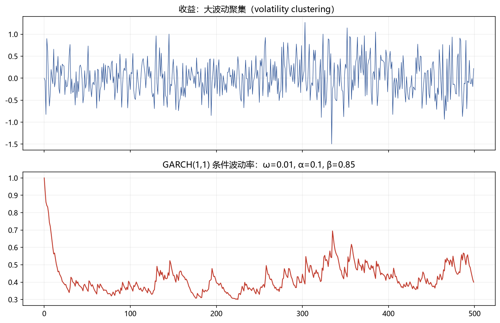

# 05 波动率（GARCH / 已实现波动率 / EWMA）

> 面试权重：★★★★☆ ｜ 难度：中→高 ｜ 来源：[S2 Q11][S3 T3]
> 定位：波动率不是常数——风险度量（VaR）、仓位管理都依赖它。

## 一、教学

### 1.1 波动率聚集

大波动后面跟着大波动（volatility clustering）→ 无条件方差常数，但条件方差随时间变。

### 1.2 GARCH(1,1)

$$\sigma_t^2 = \omega + \alpha\,\varepsilon_{t-1}^2 + \beta\,\sigma_{t-1}^2$$

$$\varepsilon_t = \sigma_t z_t, \qquad z_t \sim \text{i.i.d.}(0,1)$$

关键参数：

- α（ARCH 项）：对冲击的反应速度
- β（GARCH 项）：波动持续性
- α + β ≈ 1 → 高持续（接近 IGARCH），冲击影响很久

### 1.3 已实现波动率

日内高频收益平方和：RV = Σrᵢ² —— 比日收益平方更稳的波动估计。

### 1.4 EWMA（RiskMetrics）

$$\sigma_t^2 = \lambda\,\sigma_{t-1}^2 + (1-\lambda)\,r_{t-1}^2, \qquad \lambda = 0.94 \ (\text{日频})$$

不需要估计 ω/α/β，一步递推，机构常用。

### 1.5 与 VaR 联动

$$VaR_{95\%} = 1.645 \times \sigma_t$$

（详见 06 模块 02 章。）

## 二、例题精讲

**例 1｜GARCH 参数解读**

α=0.05、β=0.92：单次冲击对波动影响持续约 1/(1−0.97) ≈ 33 天。

**例 2｜EWMA 一步预测**

λ=0.94，昨日波动 1%、昨日收益 2%：

$$\sigma_t^2 = 0.94\times 0.01^2 + 0.06\times 0.02^2 = 0.000118 \ \Rightarrow \ \sigma_t \approx 1.09\%$$

**例 3｜波动率预测 VaR**

σ = 1.2% → 95% 日 VaR = 1.645 × 1.2% ≈ 1.97%。

## 三、面试题

**热身**

1. 什么是波动率聚集？ → 大波动成群出现。
2. GARCH 的 α+β 接近 1？ → 持续性高。

**核心**

3. GARCH(1,1) 公式？ → σ²ₜ = ω + α·ε²ₜ₋₁ + β·σ²ₜ₋₁。
4. EWMA 的 λ 常用值？ → 0.94（日频 RiskMetrics）。
5. 已实现波动率是什么？ → 日内高频收益平方和。

**进阶**

6. 为什么用条件波动率做 VaR？ → 静态方差忽略聚集，低估尾部。
7. GARCH 与正态假设的冲突？ → 用 t 分布/偏 t 改进尾部。

## 四、参考

- [S3] Empirical Method Topic 3（异方差、GARCH、VaR）
- [S7] Tsay Ch3（波动率模型）；arch 库
