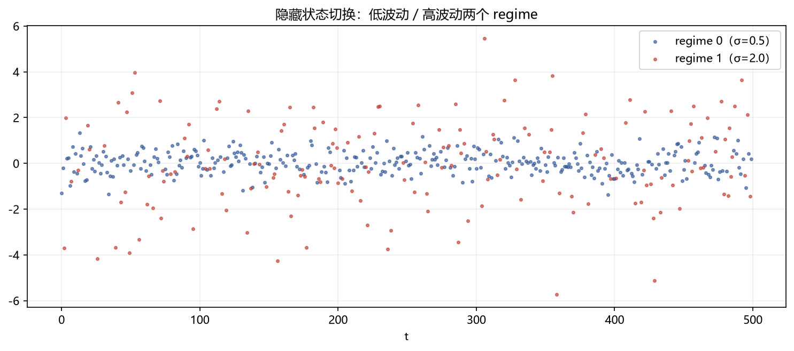

# 06 状态空间（Kalman / HMM）

> 面试权重：★★★☆☆ ｜ 难度：高 ｜ 来源：[S3 T2][S4 Ch9]
> 定位：让参数"时变"——时变 beta、regime 切换，多资产配置的进阶工具。

## 一、教学

### 1.1 状态空间模型

观测方程 + 状态方程：

$$y_t = Z_t\,\theta_t + \varepsilon_t \qquad (\text{观测})$$

$$\theta_t = T\,\theta_{t-1} + \eta_t \qquad (\text{状态演化})$$

### 1.2 Kalman 滤波

递归两步：

1. **预测**：用状态方程先验 θₜ|ₜ₋₁
2. **更新**：用观测 yₜ 修正（卡尔曼增益权衡预测与观测）

> 应用：时变 beta 估计、时变动量、去噪。

### 1.3 隐马尔可夫模型（HMM）

离散隐藏状态（如"牛/熊"），状态按转移矩阵切换，观测由各状态分布生成：

$$P(s_t = j \mid s_{t-1} = i) = p_{ij}, \qquad y_t \sim f_{s_t}(y_t)$$

用前向后向算法/Viterbi 推断状态；对应"宏观 regime"建模。

### 1.4 在资产配置中的角色

- 用 HMM 识别低/高波动 regime → 配置权重随 regime 调整
- Kalman 估计时变 beta → 动态对冲比率

## 二、例题精讲

**例 1｜时变 beta**

市场收益 mₜ，个股 rₜ：rₜ = βₜ·mₜ + εₜ，βₜ 随机游走 → Kalman 实时更新 β̂ₜ。

**例 2｜两状态 HMM**

低波动 regime 概率连续 20 天 > 0.8 → 系统处于低波动 → 降风险预算。

**例 3｜为什么比滚动窗口好**

滚动窗口滞后、需要定窗长；Kalman/HMM 用全部历史 + 结构化演化，平滑且及时。

## 三、面试题

**热身**

1. Kalman 两步？ → 预测 + 更新。
2. HMM 的状态？ → 离散隐藏状态，如牛/熊。

**核心**

3. 卡尔曼增益做什么？ → 权衡预测与观测的权重。
4. HMM 怎么推断状态？ → 前向后向/Viterbi。
5. 时变 beta 用什么？ → Kalman 滤波。

**进阶**

6. 状态空间 vs 滚动窗口？ → 前者结构化、无窗长选择。
7. regime 与资产配置？ → 权重随 regime 调整（风险预算）。

## 四、参考

- [S3] Empirical Method Topic 2（Kalman）
- [S4] machine-learning-for-trading Ch9（HMM regime）
- [S7] Tsay Ch11-12；hmmlearn / statsmodels `SARIMAX`
