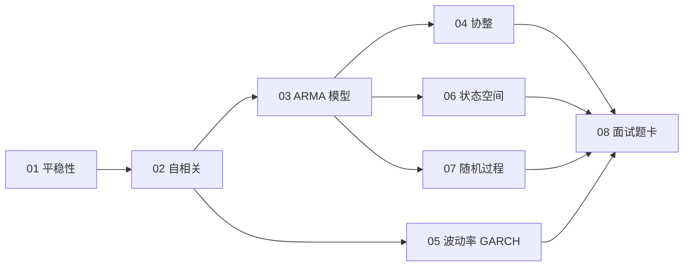

# 📈 03_time_series · 时间序列计量

QS 多资产研究的主战场：价格/收益的时序性质，全部从这里来。

> JD 证据：time-series analysis、cointegration、econometrics（真实岗位要求，2026-09 检索）
> 公式规范：独立公式用 LaTeX 渲染，正文用 Unicode，无乱码。

## 🎯 定位

对 A 的多资产/资产配置方向，这是与岗位最贴的模块：动量、regime、协整、GARCH 全在这里。每章按"教学（概念 + 图）→ 例题精讲 → 面试题（热身/核心/进阶）→ 参考"组织。

## 🗺️ 学习路径

## 📚 章节地图

| # | 章节 | 核心主题 | 链接 |
| --- | --- | --- | --- |
| 01 | 平稳性 | ADF/KPSS、单位根、随机游走假说 | [打开](01_平稳性.md) |
| 02 | 自相关 | ACF/PACF、Ljung-Box、Hurst、方差比 | [打开](02_自相关.md) |
| 03 | ARMA 模型 | AR/MA/ARIMA、预测、VAR、AIC/BIC | [打开](03_ARMA.md) |
| 04 | 协整 | Engle-Granger、Johansen、配对交易 | [打开](04_协整.md) |
| 05 | 波动率 | GARCH、已实现波动率、EWMA | [打开](05_波动率.md) |
| 06 | 状态空间 | Kalman、HMM regime | [打开](06_状态空间.md) |
| 07 | 随机过程 | GBM、OU 过程、泊松过程 | [打开](07_随机过程.md) |
| 08 | 面试题卡 | 30 题分组刷 + 考前清单 | [打开](08_面试题卡.md) |

## 📊 面试权重

| 主题 | 频率 | 难度 | 说明 |
| --- | --- | --- | --- |
| 01 平稳性 | ★★★★★ | 中 | ADF/KPSS 必考 |
| 02 自相关 | ★★★★☆ | 中 | ACF、Hurst、方差比 |
| 03 ARMA | ★★★☆☆ | 中→高 | 模型选择 AIC/BIC |
| 04 协整 | ★★★★☆ | 高 | 配对交易核心 |
| 05 波动率 | ★★★★☆ | 中→高 | GARCH 与 VaR 联动 |
| 06 状态空间 | ★★★☆☆ | 高 | regime 建模加分 |
| 07 随机过程 | ★★★☆☆ | 高 | GBM/OU 常考 |

## 🖼️ 配图（assets/）

平稳 vs 非平稳、ACF 对比、协整价差、GARCH 波动聚集、regime 切换——`make_figures.py` 可重新生成。

## 📜 来源

- [S2] awesome-quant-interview（Q10 平稳性、Q11 ARIMA/GARCH、Q12 协整、Q14 GBM）
- [S3] Empirical Method in Finance（Topic 1-3：时序计量完整课程）
- [S7] Tsay《Analysis of Financial Time Series》、绿皮书
