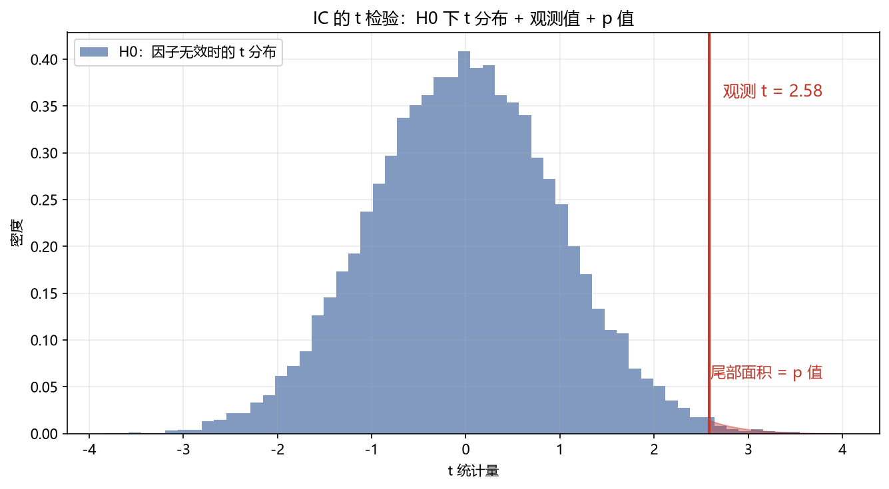

# 01 IC 显著性（IC / IR / t 统计）

> 面试权重：★★★★★ ｜ 难度：中 ｜ 来源：[S2 Q32][S4 Ch7][S5]
> 定位：因子研究的第一行代码——"这个信号到底有没有预测力"。

## 一、教学

### 1.1 IC 定义

**IC（信息系数）**：因子值与未来收益的相关系数。

$$\mathrm{IC}_t = \mathrm{corr}(f_t,\ r_{t+1})$$

**Rank IC**：用秩相关（Spearman），对异常值稳健，实务更常用。

### 1.2 IC 的显著性：t 统计

对 T 期 IC 序列：

$$t = \frac{\overline{IC}}{\hat\sigma_{IC}/\sqrt{T}} = \frac{\text{mean}(IC)\times\sqrt{T}}{\text{std}(IC)}$$

\|t\| > 2 → 拒绝"IC=0"。**重叠样本（预测期 > 频率）时用 HAC 标准误**。

### 1.3 IC 衰减

按持有期 k 计算 IC(k)：IC 随 k 衰减的速度决定调仓频率。

### 1.4 IR（信息比率）

$$\mathrm{IR} = \frac{\overline{IC}}{\mathrm{std}(IC)} \approx \frac{\text{超额收益}}{\text{跟踪误差}}$$

> 直觉：IR 是"每单位因子波动换来的 IC"，是因子体检的核心指标。

## 二、例题精讲

**例 1｜t 检验手算**

T=60，mean(IC)=0.04，std=0.12：t = 0.04×7.75/0.12 ≈ 2.58 → 显著。

**例 2｜重叠样本**

月频因子预测 3 个月收益 → IC 序列重叠 → 普通 t 虚高 → Newey-West 修正后可能只有 1.9 → 结论反转。

**例 3｜IC 衰减决定频率**

IC(1)=0.05、IC(5)=0.04、IC(20)=0.02 → 信号 5 天内衰减快 → 高换手。

## 三、面试题

**热身**

1. IC 是什么？ → 因子与未来收益的相关系数。
2. Rank IC 为什么常用？ → 对异常值稳健。

**核心**

3. IC 的 t 统计公式？ → mean·√T/std。
4. IR 是什么？ → mean(IC)/std(IC)。
5. 重叠样本怎么办？ → HAC 标准误。

**进阶**

6. IC 显著但收益不显著？ → 因子与收益非线性/极端值/成本吃掉。
7. IC 衰减怎么用？ → 决定持有期与调仓频率。

## 四、参考

- [S2] awesome-quant-interview Q32（IC/IR）
- [S4] Ch7（IC、标签、可行性筛选）
- [S5] purgedcv（HAC t 与路径指标）
