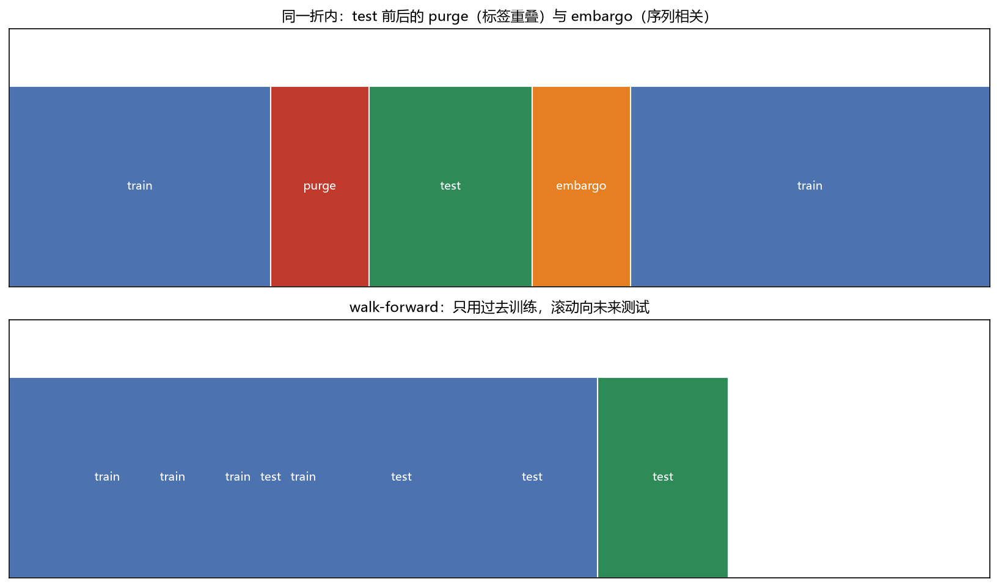

# 02 泄漏控制（look-ahead / purge / embargo）

> 面试权重：★★★★★ ｜ 难度：中 ｜ 来源：[S2 Q52][S4 Ch7][S5]
> 定位：面试官必问"有没有前视"——泄漏是回测好看但实盘亏钱的第一大原因。

## 一、教学

### 1.1 三类常见泄漏

1. **前视偏差**：用了 t 时刻之后才知道的数据（如未来收益做特征）
2. **幸存者偏差**：回测样本只包含活到今天的标的
3. **数据点实时**：用今天修正过的财报/指数成分回测历史

### 1.2 标签重叠泄漏

标签 rₜ₊ₕ 与相邻训练样本重叠 → 训练集"偷看"了测试集答案。

### 1.3 purge（清洗）与 embargo（隔离带）

- **purge**：删除与测试期标签重叠的训练样本
- **embargo**：再删测试期之后一段缓冲（序列相关仍会泄漏）

### 1.4 walk-forward

只用过去训练、滚动向未来测试（见上图下半部分）——部署时就是这么用的。

## 二、例题精讲

**例 1｜前视偏差案例**

用"当月披露的财报"预测当月收益——财报实际滞后披露 → 未来函数。

**例 2｜purge 间隔**

预测期 h=20 天：训练样本预测日落在测试期 20 天窗口内 → 全部 purge。

**例 3｜embargo 大小**

测试期后再删 1% 样本（或固定 20 天）→ 阻断序列相关。

## 三、面试题

**热身**

1. 什么是前视偏差？ → 用了未来才知道的数据。
2. 幸存者偏差？ → 样本只包含存活的标的。

**核心**

3. purge 删什么？ → 与测试标签重叠的训练样本。
4. embargo 为什么还要？ → 序列相关泄漏。
5. walk-forward 是什么？ → 只用过去训练，滚动预测。

**进阶**

6. 怎么审计泄漏？ → 数据点实时测试、信息时间戳检查。
7. 泄漏对结果的影响方向？ → 系统性高估，方向不可逆。

## 四、参考

- [S2] awesome-quant-interview Q52（信息泄漏）
- [S5] purgedcv（purge/embargo/audit）
- [S4] Ch7（标签与泄漏防护）
