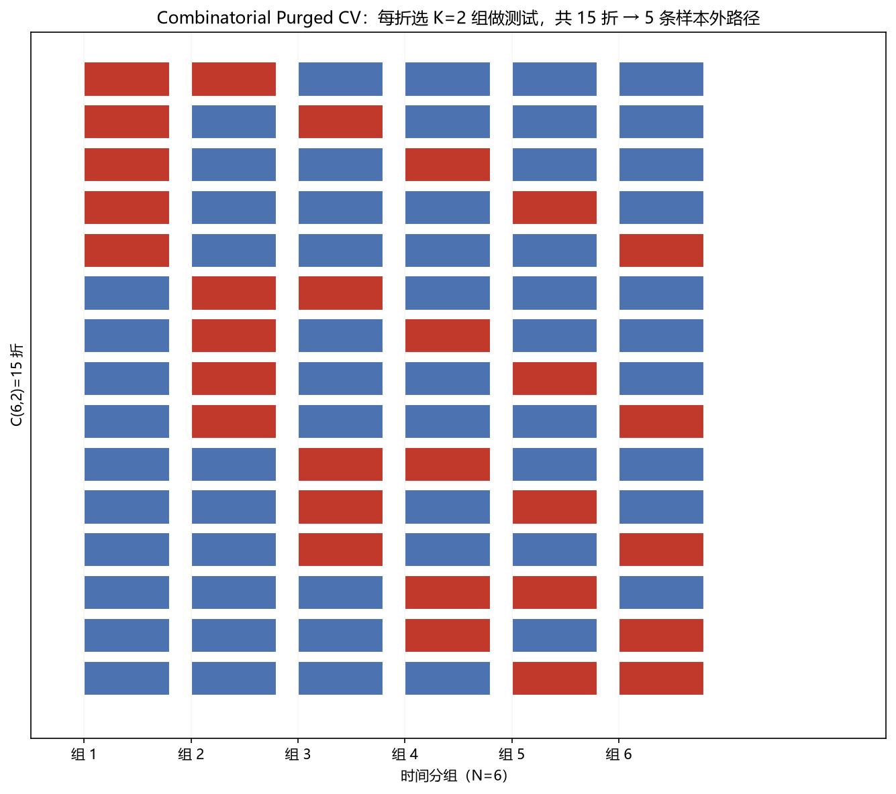

# 03 CPCV（Combinatorial Purged CV）

> 面试权重：★★★★☆ ｜ 难度：高 ｜ 来源：[S5][S7] AFML Ch12
> 定位：样本外验证的黄金标准——不是一条样本外曲线，而是多条。

## 一、教学

### 1.1 为什么普通 KFold 不行

时间序列标签重叠 + 序列相关 → 普通随机切分泄漏（详见 02 章）。

### 1.2 什么是 CPCV

把数据按时间分成 N 组，每次选 K 组做测试，其余训练（带 purge + embargo）：

- 折数 = C(N, K)
- 样本外路径数 = C(N−1, K−1)（每条路径覆盖完整时间跨度）

例：N=6、K=2 → 15 折、5 条样本外路径。

### 1.3 路径重建

把每折的样本外预测按时间拼成多条完整路径 → 每条路径都能算夏普/回撤 → 得到"绩效分布"而非单一数字。

### 1.4 优点

1. 所有样本都当过测试集（更充分利用数据）
2. 多条路径 → 绩效稳健性分布
3. 与 DSR/PBO 配合，直接给"多重试验校正"输入

## 二、例题精讲

**例 1｜N=6, K=2**

C(6,2)=15 折，C(5,1)=5 条路径；每条路径约覆盖 2/6 时间（测试占比 K/N）。

**例 2｜路径绩效分布**

5 条路径夏普：1.1 / 0.9 / 0.7 / 1.3 / 0.4 → 中位数 0.9，最差 0.4 → 比"单一路径夏普 1.0"信息量大得多。

**例 3｜和 walk-forward 的区别**

walk-forward 只有一条向前路径；CPCV 产生多条路径，能度量"路径依赖的稳健性"。

## 三、面试题

**热身**

1. CPCV 的 N 和 K？ → N 组里选 K 组测试。
2. 折数怎么算？ → C(N,K)。

**核心**

3. 为什么比普通 KFold 好？ → 防泄漏 + 多条路径。
4. 样本外路径数？ → C(N−1, K−1)。
5. purge/embargo 还用吗？ → 用，每折都要。

**进阶**

6. CPCV 与 DSR 的关系？ → 多条路径 = 多次试验 → DSR 校正。
7. K 越大测试占比？ → K/N，K 太大路径太短。

## 四、参考

- [S5] purgedcv（CombinatorialPurgedCV、reconstruct_paths）
- [S7] de Prado《AFML》Ch12
