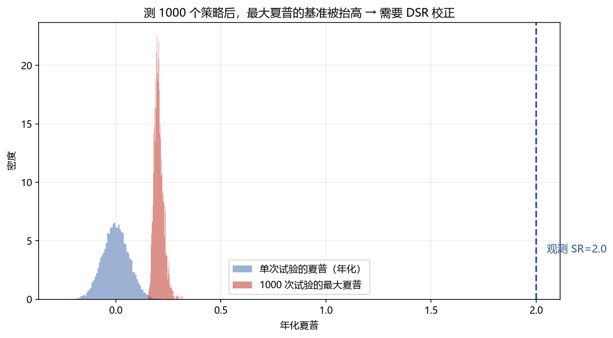

# 04 DSR / PSR（Deflated / Probabilistic Sharpe）

> 面试权重：★★★★☆ ｜ 难度：高 ｜ 来源：[S4 Ch16][S5][S7] Bailey & López de Prado (2014)
> 定位：回答"测了很多策略，这个夏普还信吗"——用试验次数给夏普打折。

## 一、教学

### 1.1 PSR（概率夏普）

给定观测夏普 SR̂，真实夏普超过基准 SR* 的概率：

$$\mathrm{PSR}(SR^*) = \Phi\!\left(\frac{(\hat{SR}-SR^*)\sqrt{T-1}}{\sqrt{1-\gamma_3\,\hat{SR}+\frac{\gamma_4-1}{4}\,\hat{SR}^2}}\right)$$

γ₃、γ₄ 是偏度、峰度（收益不正态时修正）。

### 1.2 多重试验问题

测 N 个策略取最好的 → 期望最大夏普随 N 上升：

### 1.3 DSR（去通胀夏普）

把基准从 0 换成"随机试验期望的最大夏普" E[max SR]：

$$\mathrm{DSR} = \mathrm{PSR}(E[\max_{n}\ SR_n])$$

E[max SR] 由 N（或有效试验数 K_eff）、偏度、峰度决定。

### 1.4 MinTRL / MinBTL

- **MinTRL**：要确立某夏普显著，最少需要多少观测
- **MinBTL**：某回测长度下，夏普多高才不可能是运气

## 二、例题精讲

**例 1｜直觉数字**

测 1000 个纯噪声策略，最好年化夏普期望约 2.0；你测出 2.0 → DSR 不显著。

**例 2｜DSR 门槛**

同样夏普 2.0：只测 1 个策略时 DSR 显著；测 1000 个后 DSR p 值 > 0.05 → 被"试验次数"吃掉。

**例 3｜MinBTL**

年化夏普 1.5 需要约 5 年以上数据才能排除运气（MinBTL 查表）。

## 三、面试题

**热身**

1. PSR 是什么？ → 真实夏普超过基准的概率。
2. 偏度/峰度为什么进公式？ → 收益非正态修正。

**核心**

3. DSR 和 PSR 区别？ → DSR 的基准是 E[max SR]。
4. 试验次数怎么影响？ → 越大，E[max SR] 越高，DSR 越难显著。
5. K_eff 是什么？ → 相关试验折算的有效独立数。

**进阶**

6. 什么时候用 MinBTL？ → 判断回测长度够不够。
7. DSR 的输入？ → SR、T、N、偏度、峰度。

## 四、参考

- [S5] purgedcv（probabilistic/deflated_sharpe_ratio、min_track_record_length）
- [S4] Ch16（DSR、RAS、White's Reality Check）
- [S7] Bailey & López de Prado (2014)
