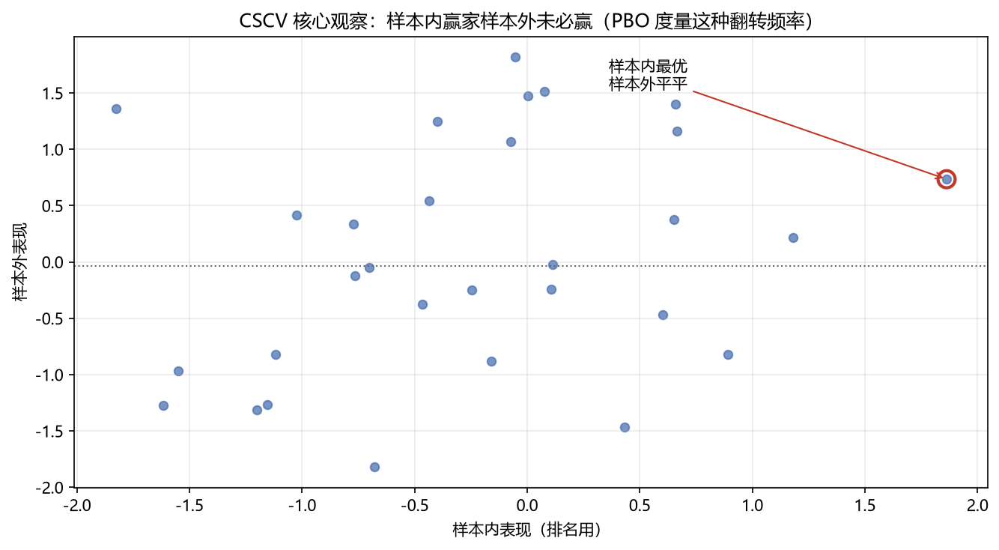

# 05 PBO（回测过拟合概率）

> 面试权重：★★★☆☆ ｜ 难度：高 ｜ 来源：[S5][S7] AFML Ch11
> 定位：用 CSCV 直接度量"样本内选出的最优配置，样本外有多大概率沦为平庸"。

## 一、教学

### 1.1 核心观察

样本内表现最好 ≠ 样本外表现最好：

### 1.2 CSCV 步骤

1. 把样本按时间分 S 组，取 C(S, S/2) 种组合
2. 每组：一半做 IS（样本内），一半做 OOS（样本外）
3. 在 IS 上选最优配置，看它在 OOS 的排名
4. **PBO** = IS 最优配置在 OOS 排名低于中位数的比例

### 1.3 解读

- PBO = 0：IS 赢家 OOS 也赢 → 稳健
- PBO = 0.5：随机水平 → 过拟合严重
- 阈值经验：PBO < 0.2 可接受

### 1.4 防御

减少参数、正则化、组合配置而非单点、用 CPCV 多条路径、报告 PBO。

## 二、例题精讲

**例 1｜CSCV 规模**

S=16 → C(16,8)=12870 种 IS/OOS 划分，每种都验证一次"IS 最优是否 OOS 最优"。

**例 2｜PBO 计算**

12870 次划分中，IS 最优配置在 OOS 排后 50% 的次数占 35% → PBO=0.35 → 警惕。

**例 3｜组合 vs 单点**

IS 上选"组合权重"比选"单策略"更稳 → PBO 更低。

## 三、面试题

**热身**

1. PBO 度量什么？ → IS 赢家 OOS 翻车的频率。
2. CSCV 是什么？ → 组合对称交叉验证。

**核心**

3. CSCV 步骤？ → 分 S 组 → C(S,S/2) 划分 → IS 选优 → OOS 排名。
4. PBO 多少算好？ → 越接近 0 越好，0.5 是随机。
5. 怎么降低 PBO？ → 少参数、正则化、组合化。

**进阶**

6. PBO 与 DSR 区别？ → PBO 看排名翻转，DSR 看夏普显著性。
7. CSCV 用哪种划分？ → 组合对称（combinatorially symmetric）。

## 四、参考

- [S5] purgedcv（CSCV、probability_of_backtest_overfitting）
- [S7] AFML Ch11（CSCV/PBO）
