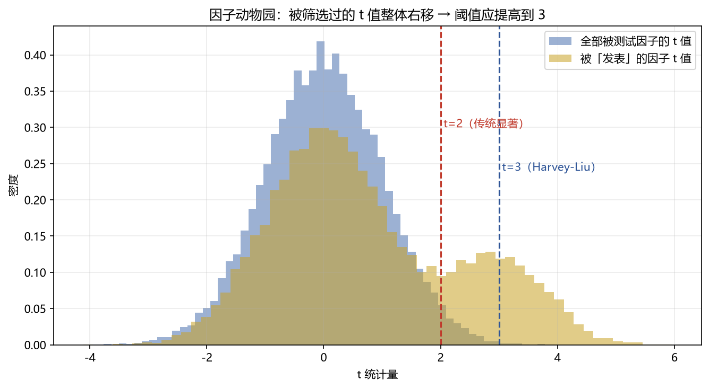

# 06 多重检验应用（BH-FDR / t≥3 / K_eff）

> 面试权重：★★★★☆ ｜ 难度：中→高 ｜ 来源：[S2 因子工厂][S4 Ch7][S7] Harvey-Liu-Zhu
> 定位：02 模块的 05 章是理论，这里是在因子研究里的实战流程。

## 一、教学

### 1.1 因子动物园

文献里几百个"显著"因子 → 很多是数据挖掘产物：

### 1.2 实战流程

1. **先验筛选**：只有经济逻辑的因子进候选
2. **FDR 控制**：BH 校正 p 值（q=0.10）
3. **t≥3 门槛**：对"被反复试过"的因子族提阈值
4. **样本外确认**：CPCV 路径 + 多市场/多时段

### 1.3 有效试验数 K_eff

试验相关时，独立试验数 < 名义试验数：

$$K_{eff} \approx \frac{N}{1 + \rho(N-1)}$$

ρ 为试验结果的平均相关。K_eff 是 DSR 的输入。

### 1.4 记录试验日志

每个被测试的因子/参数组合都记录 → 面试能说"我测了多少个、怎么校正的"。

## 二、例题精讲

**例 1｜BH 实操**

500 个候选，q=0.10：阈值线 (k/500)×0.10；满足 p(k) ≤ 线的最大的 k 个被接受。

**例 2｜K_eff**

1000 个高度相关因子（ρ=0.9）→ K_eff ≈ 1000/91 ≈ 11 → 多重试验惩罚小得多。

**例 3｜t≥3 应用**

动量文献几十篇 → 新动量变体 t=2.5 不算惊喜；全新逻辑 t=2.5 可以继续验证。

## 三、面试题

**热身**

1. 因子动物园指什么？ → 大量"显著"因子实为数据挖掘。
2. BH 控制什么？ → 错误发现率（FDR）。

**核心**

3. 因子筛选流程？ → 先验 → FDR → t≥3 → 样本外。
4. K_eff 为什么重要？ → 相关试验折成独立数。
5. 什么时候用 t≥3？ → 因子族被反复测试过。

**进阶**

6. 怎么证明你的因子不是运气？ → DSR + PBO + 多市场样本外。
7. 先验的作用？ → 降低假阳性先验，对应贝叶斯思维。

## 四、参考

- [S2] 因子工厂（101 Alphas、Lucky Factors）
- [S4] Ch7（BH-FDR、DSR）
- [S7] Harvey, Liu & Zhu (2016)
