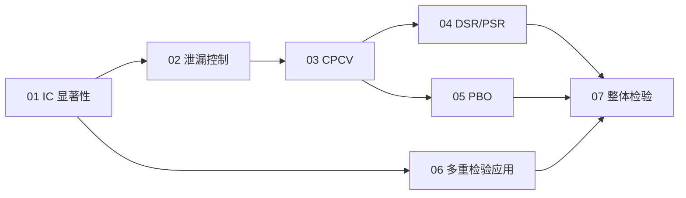

# 🛡️ 04_backtest_rigor · 回测严谨性

买方 QS 最看重的区分度：凭什么相信这个回测不是运气。

> JD 证据：overfitting risk、multiple-comparisons correction、purged cross-validation、Deflated Sharpe（真实岗位要求，2026-09 检索）
> 公式规范：独立公式用 LaTeX 渲染，正文用 Unicode，无乱码。

## 🎯 定位

会跑回测的人很多，能证明"回测不是数据挖掘的产物"的人很少。这 7 章就是后者的工具箱：IC 显著性 → 防泄漏 → CPCV → DSR → PBO → 多重检验 → 整体检验，构成一条完整的"严谨性协议"。

## 🗺️ 学习路径

## 📚 章节地图

| # | 章节 | 核心主题 | 链接 |
| --- | --- | --- | --- |
| 01 | IC 显著性 | IC/IR、HAC t 统计、IC 衰减 | [打开](01_IC显著性.md) |
| 02 | 泄漏控制 | look-ahead、purge/embargo、walk-forward | [打开](02_泄漏控制.md) |
| 03 | CPCV | Combinatorial Purged CV、路径重建 | [打开](03_CPCV.md) |
| 04 | DSR/PSR | Deflated / Probabilistic Sharpe | [打开](04_DSR与PSR.md) |
| 05 | PBO | CSCV 过拟合概率 | [打开](05_PBO.md) |
| 06 | 多重检验应用 | BH-FDR、t≥3、K_eff | [打开](06_多重检验应用.md) |
| 07 | 整体检验 | White's Reality Check、RAS | [打开](07_整体检验.md) |
| 08 | 面试题卡 | 30 题分组刷 + 考前清单 | [打开](08_面试题卡.md) |

## 📊 面试权重

| 主题 | 频率 | 难度 | 说明 |
| --- | --- | --- | --- |
| 01 IC 显著性 | ★★★★★ | 中 | 每个因子研究的起点 |
| 02 泄漏控制 | ★★★★★ | 中 | "有没有前视"是必问题 |
| 03 CPCV | ★★★★☆ | 高 | 样本外设计的黄金标准 |
| 04 DSR/PSR | ★★★★☆ | 高 | 多重试验校正 |
| 05 PBO | ★★★☆☆ | 高 | 过拟合概率 |
| 06 多重检验 | ★★★★☆ | 中→高 | 因子筛选 |
| 07 整体检验 | ★★★☆☆ | 高 | 白噪声基准 |

## 🖼️ 配图（assets/）

IC t 检验、泄漏示意图、CPCV 折矩阵、DSR 通缩、PBO 排名翻转、因子动物园——`make_figures.py` 可重新生成。

## 📜 来源

- [S4] machine-learning-for-trading（Ch7 多重检验/DSR、Ch16 回测过拟合）
- [S5] purgedcv（purge/embargo/CPCV/PSR/DSR/PBO/MinTRL）
- [S7] de Prado《AFML》、Harvey-Liu-Zhu (2016)
