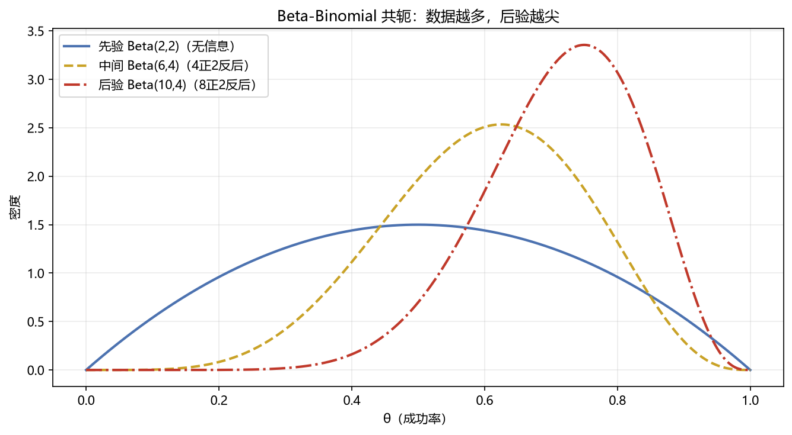
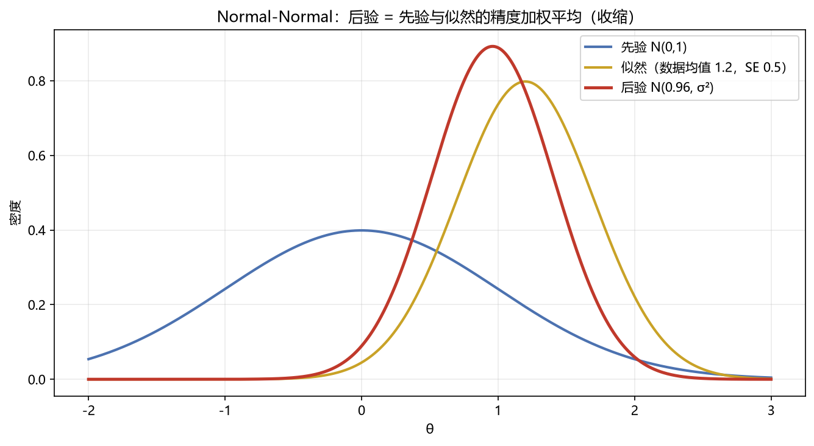

# 01 贝叶斯推断

> 面试权重：★★★☆☆ ｜ 难度：中 ｜ 来源：[S6][S7] Gelman BDA3
> 定位：把"信念"写成数学——先验 + 数据 → 后验。

## 一、教学

### 1.1 贝叶斯公式（推断版）

$$P(\theta \mid \text{数据}) \propto P(\text{数据} \mid \theta)\,P(\theta)$$

**后验 ∝ 似然 × 先验**

- 先验 P(θ)：数据之前对参数的信念
- 似然 P(数据|θ)：参数下数据的概率
- 后验 P(θ|数据)：数据之后的信念

### 1.2 共轭先验（必背两组）

| 似然 | 共轭先验 | 后验 |
| --- | --- | --- |
| Binomial | Beta(a,b) | Beta(a+成功, b+失败) |
| Normal（均值未知） | Normal | Normal（精度加权平均） |

> 共轭的意义：后验和先验同族 → 解析更新，不用 MCMC。

### 1.3 后验收缩

后验均值 = 先验与似然的精度加权平均：

$$\mu_{post} = \frac{\tau_0\,\mu_0 + \tau_1\,\bar{x}}{\tau_0 + \tau_1}, \qquad \tau = 1/\sigma^2$$

> 直觉：先验像"额外数据"——数据越多，先验的影响越小。

### 1.4 点估计

- **后验均值**：平方损失最优
- **MAP（最大后验）**：后验众数，正则化的"贝叶斯版"

## 二、例题精讲

**例 1｜Beta-Binomial**

先验 Beta(2,2)，抛 10 次得 8 正 2 反 → 后验 Beta(10,4)，后验均值 10/14 ≈ 0.71。

**例 2｜Normal-Normal 收缩**

先验 N(0,1)，数据均值 1.2、SE 0.5：

$$\mu_{post} = \frac{0 + 1.2/0.25}{1 + 4} = \frac{4.8}{5} = 0.96$$

被先验向 0 拉回——这就是"收缩"。

**例 3｜量化里怎么用**

因子 IC 估计：先验"多数因子无效"→ 后验自动收缩 → 比纯样本估计抗过拟合。

## 三、面试题

**热身**

1. 后验 ∝ 什么？ → 似然 × 先验。
2. 共轭先验是什么？ → 后验与先验同族，解析更新。

**核心**

3. Beta-Binomial 更新规则？ → Beta(a+s, b+f)。
4. 后验均值公式（Normal-Normal）？ → 精度加权平均。
5. 收缩是什么？ → 先验把估计拉向先验均值。

**进阶**

6. 先验怎么选？ → 无信息/经验/分层。
7. 贝叶斯 vs 频率派？ → 参数随机 vs 固定；信念更新 vs 长期频率。

## 四、参考

- [S6] 贝叶斯推断章节
- [S7] Gelman《BDA3》Ch1-3
