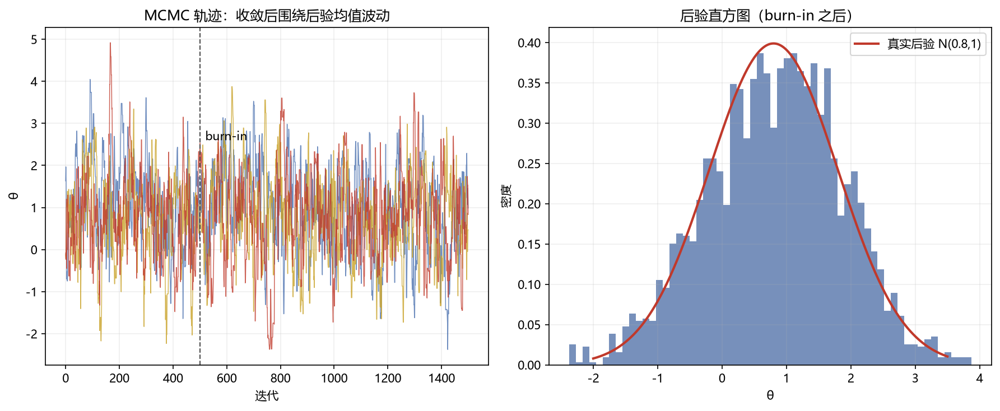

# 02 PyMC 实操（MCMC）

> 面试权重：★★☆☆☆ ｜ 难度：高 ｜ 来源：[S7] PyMC 文档
> 定位：后验没有解析解时怎么办——MCMC 采样。

## 一、教学

### 1.1 MCMC 直觉（Metropolis-Hastings）

1. 从当前 θ 出发，提出候选 θ*
2. 按后验密度比决定接受/拒绝
3. 接受 → 移动；拒绝 → 停留
4. 大量迭代后，采样分布 ≈ 后验



### 1.2 收敛诊断

- **burn-in**：丢弃早期未收敛样本
- **R-hat < 1.1**：多条链收敛一致
- **有效样本量**：自相关越低越有效

### 1.3 PyMC 代码（了解即可）

```python
import pymc as pm

with pm.Model():
    theta = pm.Beta("theta", alpha=2, beta=2)      # 先验
    obs = pm.Bernoulli("obs", p=theta, observed=data)  # 似然
    trace = pm.sample(2000, chains=4)              # 采样

pm.summary(trace)  # R-hat、有效样本量
```

### 1.4 什么时候用 MCMC

非共轭、分层、复杂结构（regime、随机波动率）→ 没有解析后验 → MCMC。

## 二、例题精讲

**例 1｜读 trace**

3 条链 burn-in 500 后都在 0.6-1.0 附近波动、R-hat = 1.01 → 收敛良好。

**例 2｜后验区间**

后验 90% 区间 [0.55, 0.85] → "成功率的可信区间"，比点估计信息多。

**例 3｜为什么不直接优化**

点估计给不出不确定性；MCMC 给整个后验分布 → 风险/区间分析的基础。

## 三、面试题

**热身**

1. MCMC 是什么？ → 用马尔可夫链采样后验。
2. burn-in？ → 丢弃早期未收敛样本。

**核心**

3. R-hat 判断？ → <1.1 视为收敛。
4. 接受率高低影响？ → 太低/太高都收敛慢。
5. 什么时候用 MCMC？ → 无解析后验时。

**进阶**

6. 有效样本量？ → 自相关越高越无效。
7. 与变分推断区别？ → MCMC 无偏但慢；VI 快但有偏。

## 四、参考

- [S7] PyMC 官方教程；Gelman《BDA3》Ch11
