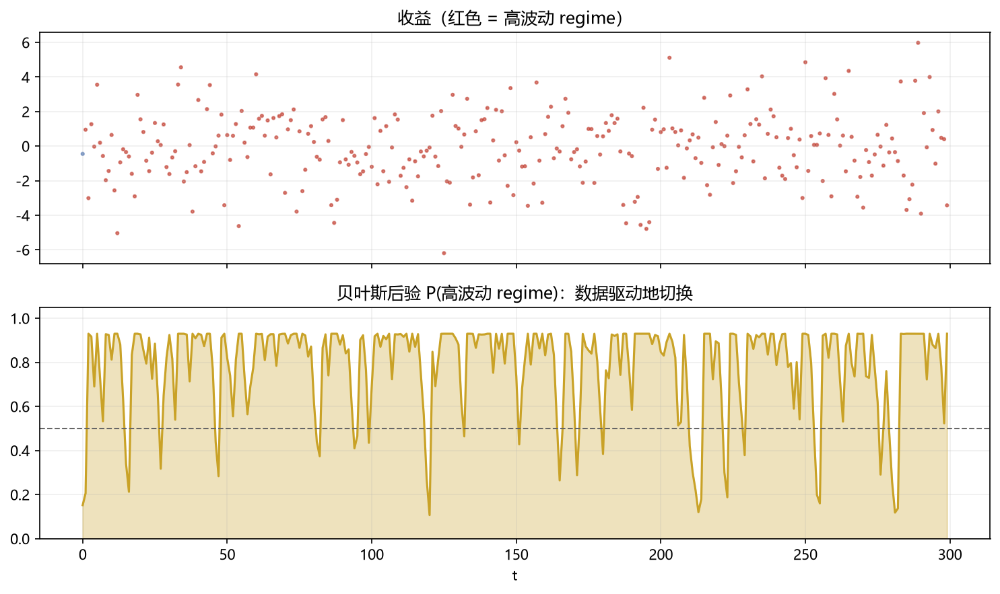

# 04 Regime（贝叶斯状态切换）

> 面试权重：★★★☆☆ ｜ 难度：高 ｜ 来源：[S4 Ch9/15]
> 定位：把"市场状态"的不确定性量化——多资产配置的进阶武器。

## 一、教学

### 1.1 问题

市场在低波动/高波动（或牛/熊）间切换，但我们不知道当前状态——用贝叶斯把"不知道"变成概率。

### 1.2 模型

隐藏状态 sₜ（如两状态），观测收益来自状态相关分布：

$$y_t \mid s_t \sim N(0, \sigma_{s_t}^2), \qquad P(s_t = j \mid s_{t-1} = i) = p_{ij}$$

贝叶斯在线更新：每来一个观测，按似然比更新状态后验概率。

### 1.3 与 HMM 的关系

HMM 是频率派视角；贝叶斯 regime 模型给状态后验分布 + 参数不确定性（分层）。

### 1.4 资产配置应用

- 高波动 regime 概率高 → 降风险预算/降杠杆
- regime 概率作为权重输入（而不是硬分类）→ 平滑切换

## 二、例题精讲

**例 1｜后验切换**

连续 10 天大波动 → P(高波动) 从 0.3 升到 0.9 → 配置降风险。

**例 2｜平滑 vs 硬切换**

权重按 P(高波动) 连续调整 → 避免 regime 突变造成的换手尖峰。

**例 3｜先验的作用**

先验 P(高波动)=0.3 → 数据不足时后验贴近先验 → 天然保守。

## 三、面试题

**热身**

1. regime 模型解决什么？ → 未知市场状态。
2. 隐藏状态是什么？ → 如低/高波动。

**核心**

3. 后验怎么更新？ → 似然比 × 先验。
4. 与 HMM 区别？ → 参数不确定性与后验分布。
5. 配置上怎么用？ → 概率驱动权重。

**进阶**

6. regime 概率高估尾部？ → 用 t/混合分布改进观测分布。
7. 多 regime 扩展？ → 三状态（牛/熊/震荡）、转移矩阵学习。

## 四、参考

- [S4] Ch9（HMM regime）、Ch15（BSTS）
- [S7] hmmlearn 文档；Hamilton (1989)
