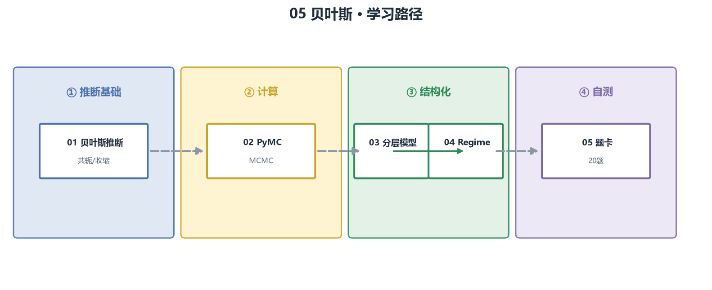

# 🧮 05_bayesian · 贝叶斯

差异化进阶：公开资源大多只给概念，这里做完整实操。

> JD 证据：无硬性要求，但"不确定性管理、regime、收缩"是买方面试的加分深度
> 公式规范：独立公式用 LaTeX 渲染，正文用 Unicode，无乱码。

## 🎯 定位

贝叶斯不是必考，但会的人很少——能讲"用后验管理不确定性"比只会点估计的候选人有层次。每章按"教学（概念 + 图）→ 例题精讲 → 面试题 → 参考"组织。

## 🗺️ 学习路径

## 📚 章节地图

| # | 章节 | 核心主题 | 链接 |
| --- | --- | --- | --- |
| 01 | 贝叶斯推断 | 先验/后验、共轭、收缩 | [打开](01_贝叶斯推断.md) |
| 02 | PyMC 实操 | MCMC、trace、收敛诊断 | [打开](02_PyMC实操.md) |
| 03 | 分层模型 | 池化、分层因子 | [打开](03_分层模型.md) |
| 04 | Regime | 贝叶斯状态切换 | [打开](04_Regime.md) |
| 05 | 面试题卡 | 20 题分组刷 | [打开](05_面试题卡.md) |

## 📊 面试权重

| 主题 | 频率 | 难度 | 说明 |
| --- | --- | --- | --- |
| 01 贝叶斯推断 | ★★★☆☆ | 中 | 共轭先验是必背 |
| 02 PyMC | ★★☆☆☆ | 高 | 会讲即可 |
| 03 分层模型 | ★★☆☆☆ | 高 | 加分项 |
| 04 Regime | ★★★☆☆ | 高 | 与多资产配置衔接 |

## 🖼️ 配图（assets/）

Beta-Binomial 更新、后验收缩、MCMC 轨迹、regime 后验——`make_figures.py` 可重新生成。

## 📜 来源

- [S6] quantitative-finance-notebooks（贝叶斯推断章节）
- [S4] machine-learning-for-trading Ch15（BSTS/因果）
- [S7] PyMC 官方文档、Gelman《BDA3》
