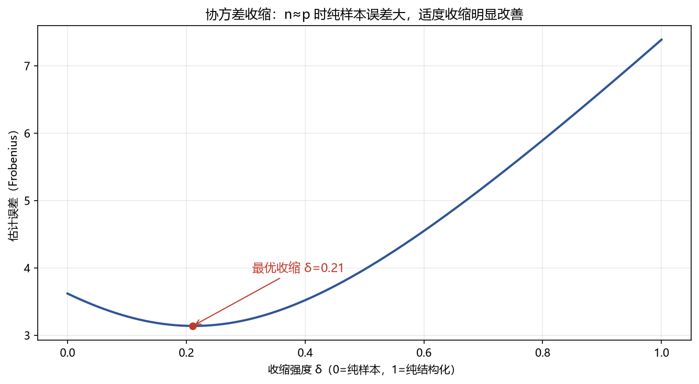

# 01 协方差估计

> 面试权重：★★★★☆ ｜ 难度：中→高 ｜ 来源：[S2 Q7][S3 T4][S7]
> 定位：组合优化的输入质量决定输出质量——协方差矩阵是重中之重。

## 一、教学

### 1.1 样本协方差的问题

$$\hat\Sigma = \frac{1}{n-1}\sum_{t}(r_t-\bar{r})(r_t-\bar{r})'$$

当资产数 p 接近样本数 n 时：

- 估计噪声爆炸（特征值分散）
- p > n 时不可逆（奇异）
- 极端权重（优化器"抄近道"）

### 1.2 收缩估计（Ledoit-Wolf）

$$\hat\Sigma_{shrink} = \delta F + (1-\delta)S$$

F 是结构化目标（如对角/常数相关），δ 由数据选择（最小化期望误差）。

### 1.3 其他估计

- **EWMA**：给近期数据更大权重（接 03 模块 05 章）
- **因子模型**：用因子暴露重建协方差（降维）
- **随机矩阵理论**：只保留超过噪声阈值的特征值

## 二、例题精讲

**例 1｜p 与 n**

300 只股票、60 个月 → p>n → 样本协方差奇异 → 必须收缩/因子模型。

**例 2｜收缩效果**

图：δ=0 时误差最大，δ≈0.3 时误差最小 → 适度收缩最优。

**例 3｜因子协方差**

Σ = βΣ_f β′ + D：用少数因子解释共同波动，D 是特异方差——比全样本稳得多。

## 三、面试题

**热身**

1. 样本协方差公式？ → 收益离差外积均值。
2. 什么时候不可靠？ → p 接近/超过 n。

**核心**

3. 收缩估计是什么？ → 样本与结构化目标的加权。
4. Ledoit-Wolf 选 δ？ → 最小化期望估计误差。
5. 因子协方差的优点？ → 降维、更稳。

**进阶**

6. 极端权重怎么来？ → 协方差噪声 → 优化器放大。
7. EWMA 协方差？ → 近期权重高，时变。

## 四、参考

- [S2] awesome-quant-interview Q7（协方差矩阵）
- [S7] Ledoit & Wolf (2004)；石川《因子投资》
