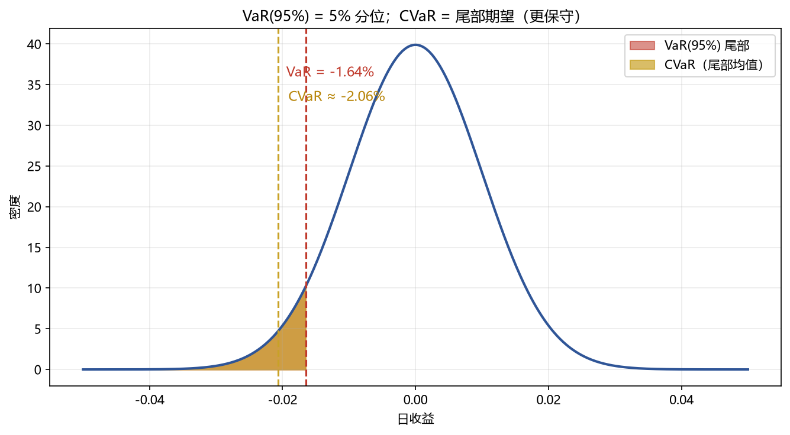

# 02 VaR 与 CVaR

> 面试权重：★★★★☆ ｜ 难度：中 ｜ 来源：[S3 T3][S4 Ch19]
> 定位：风险的第一语言——"最坏情况下亏多少"。

## 一、教学

### 1.1 VaR 定义

$$P(R \le -VaR_\alpha) = \alpha$$

VaR(95%) = 5% 分位的损失（下图红色尾部起点）。

### 1.2 三种算法

| 方法 | 做法 | 特点 |
| --- | --- | --- |
| 参数法 | 假设分布（正态/t），用分位 | 快，但假设可能错 |
| 历史模拟 | 用历史收益分位 | 无分布假设，样本依赖 |
| 蒙特卡洛 | 模拟路径取分位 | 灵活，慢 |

### 1.3 CVaR（期望损失/ES）

$$\mathrm{CVaR}_\alpha = E\big[-R \mid R \le -VaR_\alpha\big]$$

> 优于 VaR：VaR 只看门槛，CVaR 看尾部平均——极端损失多惨。监管（Basel）也转向 ES。

### 1.4 VaR 回测

例外次数检验：若 95% VaR 被击穿频率显著高于 5% → 模型低估风险。

## 二、例题精讲

**例 1｜参数法**

日波动 1% → VaR(95%) = 1.645×1% ≈ 1.65%。

**例 2｜CVaR 更保守**

正态下 CVaR(95%) ≈ 2.06% > VaR 1.65%——尾部平均比门槛更远。

**例 3｜接 GARCH**

用 GARCH 条件波动率（03 模块）算 VaR → 波动聚集时风险更新及时。

## 三、面试题

**热身**

1. VaR(95%) 含义？ → 5% 概率损失超过该值。
2. 参数法假设？ → 收益分布（正态/t）。

**核心**

3. CVaR 和 VaR 区别？ → CVaR 是尾部期望。
4. 为什么监管偏好 CVaR？ → 度量尾部深度。
5. 怎么回测 VaR？ → 例外次数检验。

**进阶**

6. 正态假设低估尾部？ → 用 t/历史模拟。
7. VaR 非次可加？ → CVaR 是 coherent 风险度量。

## 四、参考

- [S3] Empirical Method Topic 3（GARCH 应用 VaR）
- [S4] Ch19（VaR/CVaR、回撤）
