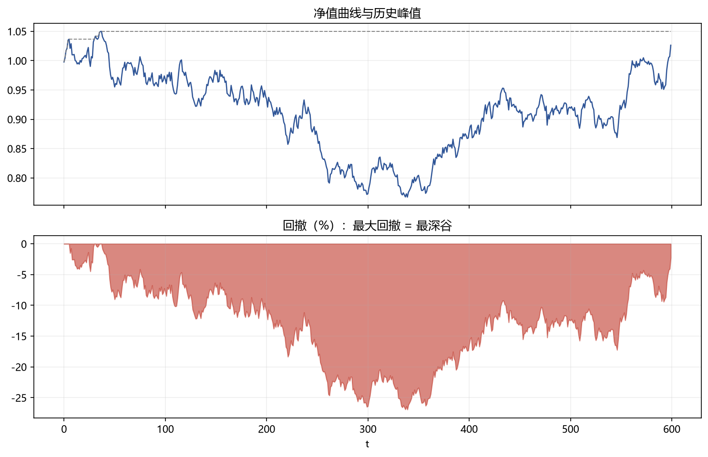

# 03 回撤

> 面试权重：★★★★☆ ｜ 难度：中 ｜ 来源：[S4 Ch19]
> 定位：买方看业绩先看回撤——策略能不能拿住钱，比能不能赚钱重要。

## 一、教学

### 1.1 最大回撤定义

$$\mathrm{MDD} = \max_{t} \frac{\text{Peak}_t - \text{Value}_t}{\text{Peak}_t}$$

### 1.2 为什么重要

- 回撤 50% 需要涨 100% 才回本（非对称）
- 回撤是"拿不拿得住"的心理学现实
- 与杠杆、相关性、尾部事件直接相关

### 1.3 回撤分布

最大回撤本身是随机变量——用模拟/bootstrap 给回撤分布，而非单点。

### 1.4 控制手段

- 仓位/风险预算随回撤下降
- 止损与降杠杆规则
- 相关性监控（回撤常来自集中）

## 二、例题精讲

**例 1｜非对称**

亏 30% 后需要涨 42.9% 回本——回撤控制比收益冲刺重要。

**例 2｜回撤分布**

500 次 bootstrap 净值路径 → 最大回撤 90% 分位 = 15% → 压力测试输入。

**例 3｜Calmar**

年化收益 / 最大回撤——买方常用的性价比指标。

## 三、面试题

**热身**

1. 最大回撤定义？ → 峰值到谷底的最大跌幅。
2. 回撤 50% 要涨多少回本？ → 100%。

**核心**

3. 为什么回撤比波动重要？ → 非对称 + 持仓体验。
4. 回撤怎么给分布？ → bootstrap/模拟。
5. Calmar 是什么？ → 年化收益/最大回撤。

**进阶**

6. 回撤与相关性的关系？ → 相关性上升 → 回撤加深。
7. 怎么给回撤设限额？ → 风险预算 + 状态机规则。

## 四、参考

- [S4] Ch19（回撤与路径风险）
- [S7] QuantStats 库（drawdown 计算）
