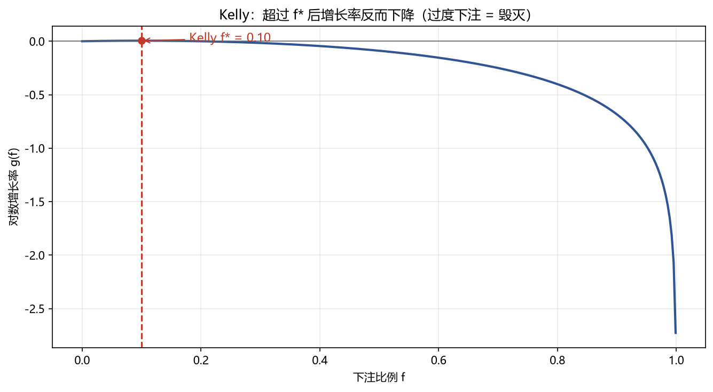

# 04 Kelly 准则

> 面试权重：★★★☆☆ ｜ 难度：中 ｜ 来源：[S4 Ch17][S7]
> 定位：仓位大小的数学——下注太少浪费优势，下注太多自我毁灭。

## 一、教学

### 1.1 Kelly 公式

单次下注（赔率 b，胜率 p）：

$$f^* = p - \frac{1-p}{b} = \frac{bp - (1-p)}{b}$$

连续情形（均值 μ、方差 σ²）：

$$f^* = \frac{\mu}{\sigma^2}$$

### 1.2 为什么是最大对数增长率

$$g(f) = p\ln(1+bf) + (1-p)\ln(1-f)$$

超过 f* 后增长率**下降**——满仓 Kelly 的波动极大，实务用分数 Kelly（如 1/4 Kelly）。

### 1.3 与破产概率

全 Kelly 破产概率理论上为 0（长期），但实际估算误差会让过度下注——分数 Kelly 是稳健选择。

## 二、例题精讲

**例 1｜单次下注**

p=0.55、b=1 → f* = 0.55 − 0.45 = 10%。

**例 2｜策略仓位**

年化超额 8%、波动 16% → f* = 8%/16%² = 3.1 倍 → 太高 → 用 1/4 Kelly = 0.78 倍。

**例 3｜过度下注**

f=30% 时增长率已明显低于 f*=10% 时——"赢面不大却重仓"是量化破产主因。

## 三、面试题

**热身**

1. Kelly 公式（离散）？ → f* = p − (1−p)/b。
2. 连续版？ → μ/σ²。

**核心**

3. 为什么超过 Kelly 增长下降？ → 对数效用曲线见顶回落。
4. 为什么用分数 Kelly？ → 参数估计误差 → 稳健。
5. 全 Kelly 的问题？ → 波动极大、估算误差敏感。

**进阶**

6. Kelly 与最大回撤关系？ → 全 Kelly 回撤深，分数 Kelly 平滑。
7. 多个独立策略怎么配？ → 各自 Kelly 再按相关性调整。

## 四、参考

- [S4] Ch17（Kelly 准则）
- [S7] Thorp (2006)；Quantitative Trading (Chan)
