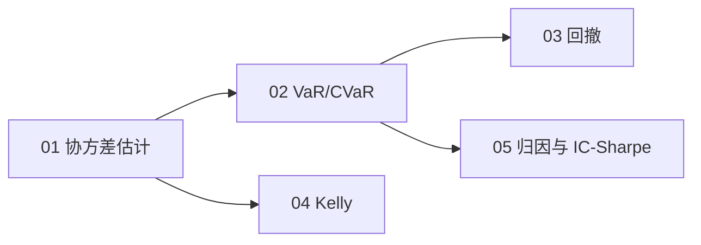

# 💼 06_portfolio_stats · 组合与风险统计

QS 第二大职责（组合构建）的统计基础：风险怎么算、回撤怎么看、仓位怎么定。

> JD 证据：optimisation、risk-aware model evaluation、VaR（真实岗位要求，2026-09 检索）
> 公式规范：独立公式用 LaTeX 渲染，正文用 Unicode，无乱码。

## 🎯 定位

Alpha 研究回答"赚不赚"，组合统计回答"亏多少、怎么不亏死"。掌握"会用、能讲"即可，深度属于优化与风险预算。每章按"教学（概念 + 图）→ 例题精讲 → 面试题 → 参考"组织。

## 🗺️ 学习路径

## 📚 章节地图

| # | 章节 | 核心主题 | 链接 |
| --- | --- | --- | --- |
| 01 | 协方差估计 | 样本/收缩/EWMA/因子模型 | [打开](01_协方差估计.md) |
| 02 | VaR 与 CVaR | 参数法、历史模拟、回测 | [打开](02_VaR与CVaR.md) |
| 03 | 回撤 | 最大回撤、回撤分布 | [打开](03_回撤.md) |
| 04 | Kelly | Kelly 公式、分数 Kelly | [打开](04_Kelly.md) |
| 05 | 归因与 IC-Sharpe | 业绩归因、Fundamental Law | [打开](05_归因与IC_Sharpe.md) |
| 06 | 面试题卡 | 25 题分组刷 + 考前清单 | [打开](06_面试题卡.md) |

## 📊 面试权重

| 主题 | 频率 | 难度 | 说明 |
| --- | --- | --- | --- |
| 01 协方差估计 | ★★★★☆ | 中→高 | 组合优化的输入 |
| 02 VaR/CVaR | ★★★★☆ | 中 | 必考概念 |
| 03 回撤 | ★★★★☆ | 中 | 买方看业绩先看回撤 |
| 04 Kelly | ★★★☆☆ | 中 | 仓位直觉 |
| 05 归因 | ★★★☆☆ | 高 | IC-IR-Sharpe 链条 |

## 🖼️ 配图（assets/）

协方差收缩、VaR/CVaR、回撤、Kelly 曲线——`make_figures.py` 可重新生成。

## 📜 来源

- [S3] Empirical Method Topic 3（VaR）
- [S4] machine-learning-for-trading Ch17/19（Kelly、VaR/CVaR、回撤）
- [S7] Grinold & Kahn（IC/IR/归因）、石川《因子投资》
