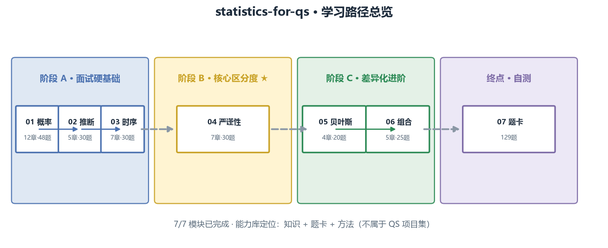

# 📊 statistics-for-qs

针对 **QS/QA 量化岗面试准备**的独立统计模块：面试能白板推导，回测能讲清"凭什么相信这个信号"。


> 面向 **QS/QA 量化岗面试准备**的独立统计学习库：概率、推断、时间序列、回测严谨性、贝叶斯、组合风险。
> 内容摘录自公开资源（题仓库、课程、书），统一格式。

## 🎯 定位

- **是什么**：统计学习库——产出教学笔记、配图与面试题卡，覆盖从概率到回测严谨性的完整链路。
- **不含什么**：真实策略、交易信号或投资建议（纯学习资料，非策略项目）。
- **质量保障**：内容全部标注公开来源 [S#]；每章统一"教学 → 例题 → 面试题 → 参考"格式。

## 🎯 先看总览

███████████████████████████████████ **100%**（7/7 模块）

| 状态 | 含义 |
| --- | --- |
| ✅ 已完成 | 章节 + 题卡 + 配图齐备 |
| ⏳ 待填充 | 目录已定，内容待写 |

| 模块 | 内容 | 状态 | 章节 | 题卡 | 配图 |
| --- | --- | --- | --- | --- | --- |
| **01 概率与组合** | 计数、贝叶斯、分布、期望技巧、CLT、随机游走/鞅、经典题、不等式、几何概率 | ✅ [进入](01_probability/README.md) | 12 | 48 | 10 |
| **02 统计推断** | MLE、假设检验、回归/Fama-MacBeth、PCA、多重检验 | ✅ [进入](02_inference/README.md) | 5 | 30 | 5 |
| **03 时间序列计量** | 平稳性、协整、GARCH、Kalman/HMM、GBM | ✅ [进入](03_time_series/README.md) | 7 | 30 | 5 |
| **04 回测严谨性 ★** | IC 显著性、CPCV、DSR、PBO、t≥3 门槛 | ✅ [进入](04_backtest_rigor/README.md) | 7 | 30 | 6 |
| **05 贝叶斯** | 推断、PyMC、分层模型、regime | ✅ [进入](05_bayesian/README.md) | 4 | 20 | 4 |
| **06 组合与风险** | 协方差、VaR/CVaR、回撤、Kelly、归因 | ✅ [进入](06_portfolio_stats/README.md) | 5 | 25 | 4 |
| **07 题卡** | 全模块汇总题库（129 题含答案 + 10 综合模拟） | ✅ [进入](07_practice/README.md) | 6 张 | 129 | — |

★ = 核心模块（买方 QS 最看重的区分度）

## 🗺️ 学习路径



主线：01 → 02 → 03 → 04（面试硬基础 → 核心），05/06 并行，全部汇入 07 题卡。

## 📚 已完成章节

**01 概率与组合**（12 章）：[01 计数与组合](01_probability/01_计数与组合.md) · [02 条件概率与贝叶斯](01_probability/02_条件概率与贝叶斯.md) · [03 随机变量与分布](01_probability/03_随机变量与分布.md) · [04 期望方差与矩方法](01_probability/04_期望方差与矩方法.md) · [05 联合分布与条件期望](01_probability/05_联合分布协方差与条件期望.md) · [06 LLN 与 CLT](01_probability/06_大数定律与中心极限定理.md) · [07 随机游走与鞅](01_probability/07_随机游走与鞅.md) · [08 经典概率题](01_probability/08_经典概率题专题.md) · [09 题卡](01_probability/09_面试题卡.md) · [10 概率不等式](01_probability/10_概率不等式.md) · [11 几何概率](01_probability/11_几何概率.md) · [12 分布关系与泊松过程](01_probability/12_分布关系与泊松过程.md)

**02 统计推断**（5 章）：[01 参数估计](02_inference/01_参数估计.md) · [02 假设检验](02_inference/02_假设检验.md) · [03 回归推断](02_inference/03_回归推断.md) · [04 降维与因子](02_inference/04_降维与因子.md) · [05 多重检验](02_inference/05_多重检验.md) · [06 题卡](02_inference/06_面试题卡.md)

**03 时间序列计量**（7 章）→ [模块目录](03_time_series/README.md)：平稳性 · 自相关 · ARMA · 协整 · GARCH · 状态空间 · 随机过程

**04 回测严谨性 ★**（7 章）→ [模块目录](04_backtest_rigor/README.md)：IC 显著性 · 泄漏控制 · CPCV · DSR/PSR · PBO · 多重检验 · 整体检验

**05 贝叶斯**（4 章）→ [模块目录](05_bayesian/README.md)：推断 · PyMC · 分层 · Regime

**06 组合与风险**（5 章）→ [模块目录](06_portfolio_stats/README.md)：协方差 · VaR/CVaR · 回撤 · Kelly · 归因

**07 汇总题卡**（129 题含答案）→ [模块目录](07_practice/README.md)：概率 30 · 推断 22 · 时序 22 · 严谨性 20 · 贝叶斯+组合 25 · 综合模拟 10

## 🚀 快速开始

内容全部是 Markdown 教学笔记 + 可重新生成的配图，不需要安装依赖：

```bash
git clone https://github.com/Aayloo/statistics-for-qs.git
cd statistics-for-qs
```

想重新生成配图时（需 Python 3.10+ 与 matplotlib）：

```bash
python 01_probability/make_figures.py
python 02_inference/make_figures.py
```

## 📐 内容规范

- **每章统一格式**：教学（概念 + 图）→ 例题精讲 → 面试题（热身/核心/进阶）→ 参考。
- **公式规范**：独立公式用 LaTeX 渲染，正文用 Unicode，无乱码。
- **来源标注**：每章内容标注 [S#] 出处，不自己发明。
- **保密红线**：全部使用公开/合成数据。

## 📄 设计依据

真实 QS/QR 岗位 JD 高频统计需求（假设检验、回归/协整、时间序列、过拟合控制、多重检验、purged CV、DSR）→ 完整分析见 [DESIGN.md](DESIGN.md)。

## 📜 来源索引

| 编号 | 来源 | 摘取内容 |
| --- | --- | --- |
| S1 | [quant_interview_prep](https://github.com/k3vv0/quant_interview_prep) | 概率/统计/组合四大块 |
| S2 | [awesome-quant-interview](https://github.com/SoYuCry/awesome-quant-interview) | 55 考点 + 数理速查 |
| S3 | [Empirical Method in Finance](https://github.com/Snowrr/Empirical-Method-in-Finance) | 量化计量课程 4 Topic |
| S4 | [machine-learning-for-trading](https://github.com/stefan-jansen/machine-learning-for-trading) | 统计相关章节（多重检验/DSR/时序） |
| S5 | [purgedcv](https://github.com/eslazarev/purged-cross-validation) | 严谨性工具（CPCV/DSR/PBO） |
| S6 | [quantitative-finance-notebooks](https://github.com/patrick-t98/quantitative-finance-notebooks) | 概率/推断/贝叶斯教学 |
| S7 | 书目 | 绿皮书、Tsay、AFML、石川《因子投资》等 |
| S8 | 真实 QS/QR JD（2026-09 检索） | 岗位统计需求证据 |

---
*2026-09 创建 · 模块独立维护*
