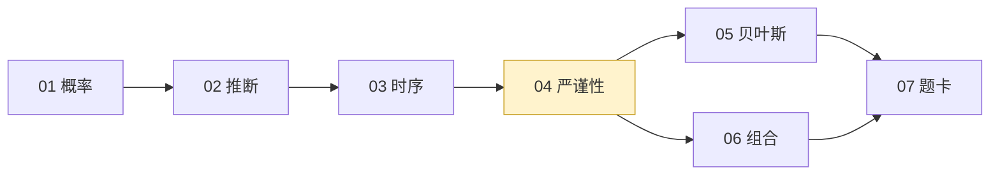

# statistics-for-qs

针对 **QS/QA 量化岗面试准备**的独立统计模块：面试能白板推导，回测能讲清"凭什么相信这个信号"。

> 独立存在，不与工作台、能力库或其他项目绑定。内容摘录自公开资源（题仓库、课程、书），统一格式。

## 进度

██████████░░░░░░░░░░░░░░░░░░░░░░░░░ **29%**（2/7 模块）

| 状态 | 含义 |
| --- | --- |
| ✅ 已完成 | 章节 + 题卡 + 配图齐备 |
| ⏳ 待填充 | 目录已定，内容待写 |

## 模块总览

| 模块 | 内容 | 状态 | 章节 | 题卡 | 配图 |
| --- | --- | --- | --- | --- | --- |
| **01 概率与组合** | 计数、贝叶斯、分布、期望技巧、CLT、随机游走/鞅、经典题、不等式、几何概率 | ✅ [进入](01_probability/README.md) | 12 | 48 | 10 |
| **02 统计推断** | MLE、假设检验、回归/Fama-MacBeth、PCA、多重检验 | ✅ [进入](02_inference/README.md) | 5 | 30 | 5 |
| **03 时间序列计量** | 平稳性、协整、GARCH、Kalman/HMM、GBM | ⏳ 待填 | — | — | — |
| **04 回测严谨性 ★** | IC 显著性、CPCV、DSR、PBO、t≥3 门槛 | ⏳ 待填 | — | — | — |
| **05 贝叶斯** | 推断、PyMC、分层模型、regime | ⏳ 待填 | — | — | — |
| **06 组合与风险** | 协方差、VaR/CVaR、回撤、Kelly、归因 | ⏳ 待填 | — | — | — |
| **07 题卡** | 概率/统计/时序题 + 考前速查 | ⏳ 待填 | — | — | — |

★ = 核心模块（买方 QS 最看重的区分度）

## 学习路径



主线：01 → 02 → 03 → 04（面试硬基础 → 核心），05/06 并行，全部汇入 07 题卡。

## 目录

```
statistics-for-qs/
├── README.md               ← 本文件（总览 + 进度）
├── DESIGN.md               设计依据（QS 岗位 JD 需求 + 最优框架）
├── 01_probability ✅        概率与组合
├── 02_inference ✅          统计推断
├── 03_time_series ⏳        时间序列计量
├── 04_backtest_rigor ★ ⏳   回测严谨性
├── 05_bayesian ⏳           贝叶斯
├── 06_portfolio_stats ⏳    组合与风险
└── 07_practice ⏳           题卡
```

## 怎么用

1. **主线顺序**：01 → 02 → 03 → 04，05/06 按需并行。
2. **每章统一格式**：教学（概念 + 图）→ 例题精讲 → 面试题（热身/核心/进阶）→ 参考。
3. **公式规范**：独立公式用 LaTeX 渲染，正文用 Unicode，无乱码。
4. **保密红线**：全部使用公开/合成数据。

## 设计依据

真实 QS/QR 岗位 JD 高频统计需求（假设检验、回归/协整、时间序列、过拟合控制、多重检验、purged CV、DSR）→ 完整分析见 [DESIGN.md](DESIGN.md)。

## 来源索引

| 编号 | 来源 | 摘取内容 |
| --- | --- | --- |
| S1 | [quant_interview_prep](https://github.com/k3vv0/quant_interview_prep) | 概率/统计/组合四大块 |
| S2 | [awesome-quant-interview](https://github.com/SoYuCry/awesome-quant-interview) | 55 考点 + 数理速查 |
| S3 | [Empirical Method in Finance](https://github.com/Snowrr/Empirical-Method-in-Finance) | 量化计量课程 4 Topic |
| S4 | [machine-learning-for-trading](https://github.com/stefan-jansen/machine-learning-for-trading) | 统计相关章节（多重检验/DSR/时序） |
| S5 | [purgedcv](https://github.com/eslazarev/purged-cross-validation) | 严谨性工具（CPCV/DSR/PBO） |
| S6 | [quantitative-finance-notebooks](https://github.com/patrick-t98/quantitative-finance-notebooks) | 概率/推断/贝叶斯教学 |
| S7 | 书目 | 绿皮书、Tsay、AFML、石川《因子投资》等 |
| S8 | 真实 QS/QR JD（2026-09 检索） | 岗位统计需求证据 |

---
*2026-09 创建 · 模块独立维护*
