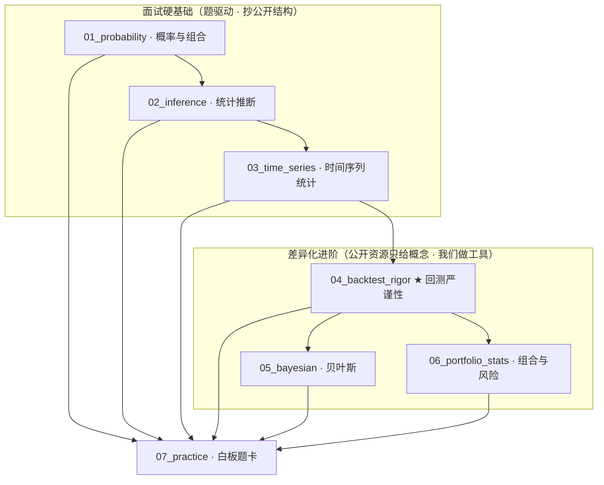

# statistics-for-qs

针对 **QS/QA 量化岗面试准备**的独立统计模块：面试要能白板手写推导，也要能讲清回测为什么大多不可信。

> 独立存在，不与工作台、能力库或其他项目绑定。内容摘录自公开资源（题仓库、课程、书），统一格式，不自己发明。

## 模块总览



## 目录

```
statistics-for-qs/
├── README.md               ← 本文件
├── DESIGN.md               设计 + 缺口分析
├── 01_probability          概率与组合：计数、贝叶斯、分布、期望技巧、CLT、随机游走/鞅、经典题+40题卡
├── 02_inference            统计推断：MLE、假设检验、回归/Fama-MacBeth、PCA、多重检验
├── 03_time_series          时间序列：平稳性、自相关、ARMA、协整、GARCH、Kalman/HMM、GBM
├── 04_backtest_rigor ★     回测严谨性：IC显著性、泄漏控制、CPCV、DSR、PBO、t≥3门槛
├── 05_bayesian             贝叶斯：推断、PyMC、分层模型、regime switching
├── 06_portfolio_stats      组合与风险：协方差、VaR/CVaR、回撤、Kelly、归因
└── 07_practice             白板题卡：概率/统计/时序题 + 考前速查
```

## 怎么用

1. **主线顺序**：01 → 02 → 03 → 04，05/06 按需并行。
2. **每个文件统一格式**：概念（标注来源）→ 手写/代码实现 → 面试题 → 参考链接。
3. **04 是重点模块**：回测严谨性的概念 + 实现都要能讲、能写。
4. **保密红线**：全部使用公开/合成数据。

## 来源索引

| 编号 | 来源 | 摘取内容 |
| --- | --- | --- |
| S1 | [quant_interview_prep](https://github.com/k3vv0/quant_interview_prep) | 概率/统计/组合四大块 |
| S2 | [awesome-quant-interview](https://github.com/SoYuCry/awesome-quant-interview) | 55 考点 + 数理速查 |
| S3 | [Empirical Method in Finance](https://github.com/Snowrr/Empirical-Method-in-Finance) | 量化计量课程 4 Topic |
| S4 | [machine-learning-for-trading](https://github.com/stefan-jansen/machine-learning-for-trading) | 统计相关章节（多重检验/DSR/时序） |
| S5 | [purgedcv](https://github.com/eslazarev/purged-cross-validation) | 严谨性工具（CPCV/DSR/PBO） |
| S6 | [quantitative-finance-notebooks](https://github.com/patrick-t98/quantitative-finance-notebooks) | 概率/推断/贝叶斯教学 |
| S7 | 书目 | 绿皮书、Tsay、AFML、石川《因子投资》等 |

---
*2026-09 创建*
